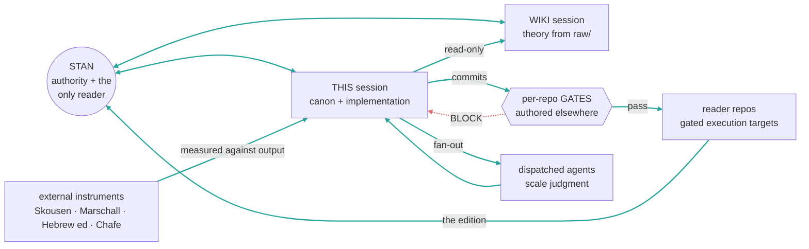

---
cssclasses:
  - wide
---

# Collapsed maturation loops — the two-partner model

> **Plain-language version.** Today you talk to three or four Claudes and carry messages between them. This document draws what happens if you talk to only two — the theory vault and this one — and the reader repos stop being conversation partners and become machines that this one drives. For each loop it says how it would work, what gets weaker, how to hold that weakness down, and what is simply lost.

**Status: PROPOSAL.** Nothing here is adopted. Drawn 2026-08-08 at Stan's request after he named the real defect: *"you are, in effect, making me the messenger boy."*

---

## The topology



```
   STAN ──┬── WIKI session ......... theory, from raw/ only
          └── THIS session ......... canon + implementation
                  │  reads wiki (read-only)
                  │  dispatches agents for scale judgment
                  ▼
              [ GATES ] ── BLOCK ──▶ back to me
                  │ pass
                  ▼
             reader repos ──▶ the edition ──▶ STAN reads it
   external instruments (Skousen, Marschall, Hebrew ed, Chafe) ──▶ measured here
```

**What changed:** Stan holds two conversations, not four. He is the *authority* and the *reader*, never the transport. Reader repos keep their gates and lose their personas.

---

## Loop by loop

### Loop 1 — Canon amendment
**Collapsed:** unchanged in shape. Friction → proposal → §7.3 gate → canon.
**Weaker because:** no peer session ever reads my commits. Today the §7.5 audit-status declaration is self-reported and appears on only 24% of canon-touching commits; with no sibling who might notice, that number is the whole story.
**Mitigation:** a commit-message gate that *refuses* a canon-touching commit lacking a §7.5 declaration. Mechanical, not self-reported.

### Loop 2 — Retraction → promotion
**Collapsed:** I log the retraction and I would draft the promotion — **retractor and promoter become the same node.**
**Weaker because:** that is a conflict of interest by construction. Today it was contained by accident: Stan denied both promotions I drafted because he saw they'd entrench the rejection of *breath*, one day before he proposed making breath near-definitional.
**Mitigation:** promotion stays Stan's (§7.1, already true), the three-strike threshold stays mechanical, and the counting rule is fixed to distinct events. Do **not** let me both count and promote.

### Loop 3 — File-back
**Collapsed:** **improves.** One evidence store instead of three, and the routing question — which of `readers-*/2-evidence`, `atu-method/2-evidence`, wiki `findings/` — simply dissolves.
**Weaker because:** nothing meaningful.
**Mitigation:** n/a. This loop is a straight win.

### Loop 4 — Audit
**Collapsed:** **the worst hit. I would be auditing myself.**
**Weaker because:** today's evidence is unambiguous. `readers-bofm`'s pre-commit hook — which I did not write — blocked my commit and I only learned it by re-checking. `atu-method`'s pointer checker — which I wrote and tuned — reported clean while 103 citations dangled, because the checker and the tool that broke them shared my blind spot. **Gates I authored do not catch me.**
**Mitigation, three layers:** (a) reader gates stay strong and stay *independently authored* — this is the non-negotiable condition of the whole model; (b) the hostile half runs as **dispatched subagents with fresh context and adversarial lenses**, never as my own re-read; (c) `loop_health.py` stays mechanical — dates and counts, never opinions.

### Loop 5 — Theory ↔ experiment
**Collapsed:** **improves, and this is the strongest argument for the model.** The findings→canon edge that had no owner gets one: this session reads the wiki read-only, holds the measurements, and carries the consequence into canon. That is exactly the role the wiki session independently proposed.
**Weaker because:** theory and implementation now share a node's priors on the *implementation* side.
**Mitigation:** the wiki stays a separate conversation. That separation is the single thing preserving theory-side independence, and it is why the answer is **two** partners rather than one.

### Loop 6 — Reader experience
**Collapsed:** unchanged. Stan reads; observations land in `2-evidence/reader-observations.md`.
**Weaker because:** nothing — this loop never involved the reader sessions.
**Mitigation:** n/a. Note this is the only instrument that actually reads, and it stays entirely with Stan.

### Substrate loop
**Collapsed:** still **MISSING**. Collapsing the topology does not create it.

---

## What is genuinely lost

**Session-level independent convergence.** Three times on 2026-08-07–08, separate sessions reached the same conclusion with no coordination: the breath-unit reframe, the findings→canon gap, and the skills-location confusion. That agreement was *evidence*, and it is the one thing the collapse destroys on the implementation side. I cannot manufacture it by trying harder — two analyses from one node share one node's priors.

**Parallel throughput.** Real on paper, near-zero in practice: Stan is one person and can attend to one conversation at a time, which is why he became the bottleneck.

**Per-repo contextual discipline.** A reader's CLAUDE.md carries corpus-specific closed routes and live-parse warnings that I would not have loaded. **Mitigation:** each reader's CLAUDE.md is rewritten as an *operating contract* — gates, live parse, forbidden actions — that I must read on entry. A contract, not a persona.

---

## Would I be responsible for identifying independent convergence?

**Partly — and the honest answer is that I can orchestrate independence but cannot be it.**

**What I can genuinely own:**
- **Instrument convergence, which is the strongest form and survives the collapse untouched.** Skousen's manuscript-tradition lineation, Marschall's ancient criteriology, our own Masoretic-substrate Hebrew edition, Chafe's intonation-unit bands — these were produced by people who never saw this project and cannot be influenced by me. When four of them agree the edition runs coarse, that is real evidence, and measuring it is exactly my job. **Making this explicit and mandatory rather than incidental is the mitigation** for what's lost.
- **Dispatched adversarial checks.** Subagents with fresh context and deliberately different lenses are weaker than separate sessions but genuinely not-me. This is what §7.3 already requires.
- **Cross-transcript reconciliation.** Reading the wiki session's record and flagging where it contradicts mine, rather than harmonising.

**What I cannot own:** being the second instrument. If I run an analysis twice, that is repetition wearing the costume of corroboration — the exact failure the project already names, where the gold yardstick cannot detect a systematically coarse bar because the gold shares the bar's calibration. A single node checking itself has the same defect.

**So the honest division:** Stan and the wiki are the independent instruments; external scholarship is the strongest one; I am the *measurer* of their convergence, never a member of the set.

---

## The error rate is not weather — it has one root cause and it is fixable

An earlier draft of this document treated my mistakes as a constant to be sandbagged against with gates. Stan rejected that, correctly: *"the answer can NOT be 'I was just making errors and there's not much we can do about that.'"* So here is the actual analysis of the five errors this session, which is the honest basis for whether one implementer is safe.

| # | error | immediate cause | fix |
|---|---|---|---|
| 1 | 103 dangling canon citations | the rewriter's skip-list was tuned for **size** (skip `private/`, it holds 2.5 GB) and silently became a **correctness** hole; my verifier shared the same skip logic | enumerate targets from a source with **no skip list**; verify by **set-difference** against a pre-change snapshot |
| 2 | said four retraction patterns qualified; two do | grepped prose for a phrase when the logs carry a structured `**Sub-pattern:**` field | **parse the structure when structure exists**; never grep a field |
| 3 | shipped a SKILL.md documenting a script that was not there | wrote documentation and committed without running the command it documents | **run every documented command before commit** |
| 4 | reported "committed 9 files" while a hook had blocked the commit | read my own shell loop's `echo` as the outcome | **post-condition check**: after any commit, read `git log`/`status`, never the loop's output |
| 5 | put skills in the global bucket after being told the opposite | an instruction with two plausible readings; I picked one silently | when two readings imply **different actions**, say so instead of choosing |

**Four of the five are one error class.** In each, I trusted a **proxy for the artifact** rather than the artifact: my own echo instead of git state; a grep instead of the field; a written command instead of a run one; my reading of an instruction instead of the ambiguity. Call it **proxy-trust**. It is the same failure the project already names everywhere else — the gold yardstick cannot detect a coarse bar because the gold shares the bar's calibration — turned inward on my own reports.

**This matters for the collapse decision because proxy-trust is mechanically checkable, and three of the five fixes are automatable rather than aspirational:**

- **Post-condition verification** — after a commit, assert against `git log`/`status`. A `Stop` hook can enforce it; it is the exact shape of the discipline hooks Stan already runs.
- **Documented-command execution** — a check that every fenced command in a skill or doc actually runs. Cheap, and it would have caught error 3 at authoring time.
- **Cascade enumeration without a skip list** — already a proven procedure: on the second reorg it surfaced `readers-tanakh-morph`, a ninth repo the hardcoded tool list omitted. `repoint-paths-safely` exists as a skill precisely to make this repeatable.

The two that are not automatable — parse-don't-grep, and surface-the-ambiguity — are judgment disciplines, and they belong in the standing defaults where the other eight live, with dated warrants.

**So the honest claim is narrower and stronger than "gates will catch me":** the dominant error class is a single named failure with mechanical countermeasures, and the residual — genuine judgment error — is what gates and Stan are for. A model that relies *only* on gates is admitting the error rate is fixed. It is not.

## The condition that decides whether this is safe

**The reader gates must stay strong and independently authored.** Thin the readers' prose, their personas, their standing sessions — but not their validators. Those hooks are the only thing that reliably catches the single implementer, and today they demonstrably did.

If the gates thin along with everything else, the model has one node writing the canon, implementing it, auditing itself, and shipping — with nothing between it and the live site but Stan.

## Related

- [`improvement-loops.md`](improvement-loops.md) — the current six loops and their measured status
- [`../Pending-Decisions.md`](../Pending-Decisions.md) — the cross-repo design this depends on
- [`01-pipeline-and-gates`](../2-evidence/deployment-status.md) — gate inventory lives with each reader
