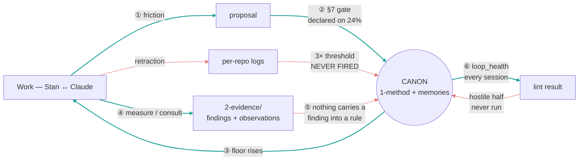
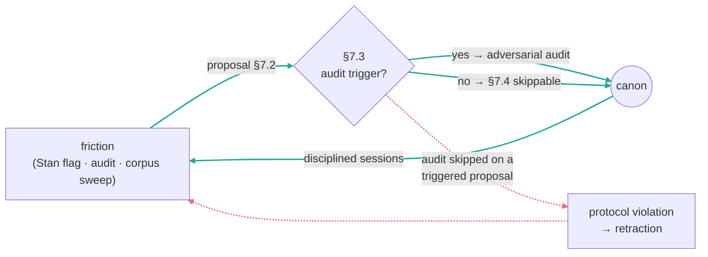
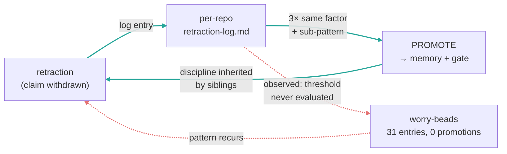
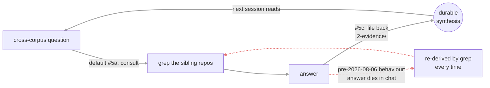
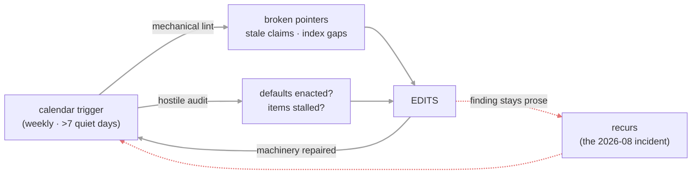
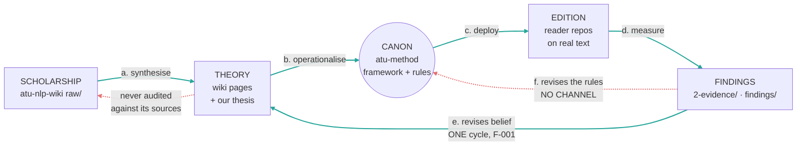
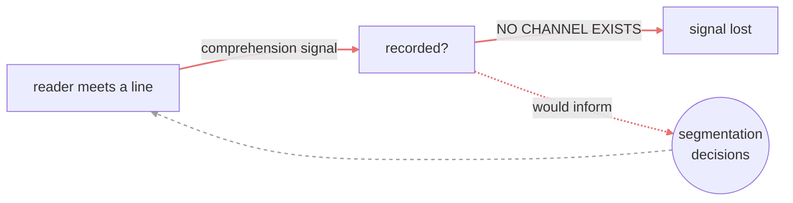

---
cssclasses:
  - wide
---

# The atu-method Improvement Loops

> **Plain-language version.** This document asks one question of six different feedback loops: *is it actually running?* A loop here means "we notice a problem → we fix the thing that caused it → the fix makes the next round better." Most of ours are not running. One has never run at all, one runs but files its results in the wrong place, one is overdue by its own rules, and one — the loop that would tell us whether real readers are helped — does not exist. Each section below opens with a plain summary of what the loop is for, whether it works, and what breaks when it doesn't.

**Summary**: The feedback loops by which this program is supposed to get better at its own work — four internal to this repo, one (loop 5, Stan's framing) spanning wiki → spec → readers → wiki, and one (loop 6) that ought to exist and doesn't — and their actual, unequal states. Only ONE is demonstrably turning: the **canon-amendment loop** (friction → proposal → §7 gate → canon), evidenced in git. The **retraction→promotion loop** is built and stalled: 31 logged retractions across three reader repos, **zero** promotions ever recorded, all logs frozen since 2026-05-17, and no log at this hub at all. The **file-back loop** and the **audit loop** were both closed on paper on 2026-08-06 and have never run. The shape is **additive, not compounding** — closing one rule-class does not make the next cheaper — with one unmeasured channel (cross-corpus porting) that might. Whether any of this measurably improves output is **unmeasured** (see Gap).

**Sources**: [`framework.md`](../1-method/framework.md) §7.0–§7.9 (change discipline); [`retraction-log-protocol.md`](retraction-log-protocol.md) (3-recurrence threshold); [`../CLAUDE.md`](../CLAUDE.md) (8 standing defaults, audit tier, file-back); `git log` of this repo (108 commits) and of `readers-bofm` / `readers-gnt` / `readers-tanakh` retraction logs; the 2026-08-06 memory-loss incident recorded in [`../.archive/_WAKEUP-DIRECTIVE-2026-08-06.md`](../.archive/_WAKEUP-DIRECTIVE-2026-08-06.md). Form (per-loop frames, failure branches, explicit Gap-marking) is borrowed from the meta-wiki's `meta-wiki/wiki/compounding-artifact.md` and `meta-wiki/wiki/ops-improvement-loop.md`; the content is not.

**Last updated**: 2026-08-06

---

## Why this is not a wiki's virtuous cycle

The meta-wiki's loops run on *compiled sources*: raw documents are ingested, integrated, and linted against an immutable corpus. This repo's ground truth is different in kind — the canon is **normative and authored**. A rule is true here because it survived an adversarial gate and Stan promoted it, not because it compresses a source faithfully. So there is no ingest loop and no source-fidelity lint, and the analogous disciplines land differently: "lint against raw" becomes "audit against gate results," and "the human promotes into the schema" becomes §7.1 authority.

Loops 1–4 are described below because they exist, not to mirror the wiki's four. Their statuses are deliberately unequal, and three of the four are reported as broken or unproven. Loop 5 is different in kind: it spans the wiki, this repo, and the readers, and it is the only one with a plausible compounding channel.

## The whole picture at a glance



Colour key — **teal** runs; **red** is built and not turning. Edges ① ② ③ are the canon-amendment loop, the only one with a track record, though ② is self-declared on just 24% of canon-touching commits. ④ now runs: `2-evidence/` received its first file-backs on 2026-08-07. ⑤ is the break Stan identified — a measurement sitting in evidence never becomes a rule proposal, and nothing carries it. ⑥ runs mechanically at every session start; the hostile half of the audit has still never been performed.

Colour key — **teal**: the one loop that demonstrably turns; **red**: the built-but-stalled retraction loop; **grey dashed**: the two loops adopted 2026-08-06 that have never executed a cycle.

```
                  ┌────────── ③ floor rises ↑ ──────────┐
                  ▼                                      │
   ┌──────────┐  ①   ┌──────────┐   ② §7 gate   ╔════════════════╗
   │   WORK   │─────▶│ proposal │──────────────▶║     CANON      ║
   │ Stan↔Cl. │      └──────────┘  audit+promote ╚════════════════╝
   └────┬─────┘                                    ▲    ▲     ▲
        ┊ retraction                               ┊    ┊     ┊
        ▼                                          ┊    ┊     ┊
   [per-repo logs] ┄ 3× threshold: NEVER FIRED ┄┄┄┄┘    ┊     ┊
   31 entries, 0 promotions, frozen 2026-05-17          ┊     ┊
                                                        ┊     ┊
   [2-evidence/]  ── ④ file-back RUNS (2 entries, 2026-08-07) ──┘     ┊
        ┊ ⑤ but nothing carries a finding into a rule proposal       ┊
   [loop_health] ── ⑥ mechanical lint every session ────────────────┘
                    hostile half still never run
```

## Loop 1 — Canon amendment (RUNS, but the evidence is weaker than first claimed)

> **In plain terms.** When something goes wrong, we write a rule so it stops going wrong. Before a rule changes, a hostile review is supposed to try to knock it down. This loop does run — but the check that a review actually happened is self-reported in the commit message, and most canon-changing commits don't report one.




```
   friction ──▶ proposal ──▶ §7.3 gate ──▶ CANON ──▶ better sessions ──┐
      ▲                          ┊ skipped                            │
      └──────────── retraction ◀─┘ (protocol violation)               │
      └───────────────────────────────────────────────────────────────┘
```

**Evidenced that it runs; NOT evidenced that its gate is honoured.** The original claim here — "12 of the last 60 commits carry a §7.5 declaration" — had no denominator, and a hostile audit on 2026-08-07 was right that it reads equally well as *48 commits skipping the gate*. Computed properly on 2026-08-07: of the last 60 commits, **50 touch canon paths** (`docs/`, `memories/`) and **12 of those 50 carry a declaration — 24%.**

So three quarters of canon-touching commits ship without the audit-status declaration §7.5 calls mandatory. That does not prove the audits were skipped — §7.5 is a self-report, so its absence proves only that the *report* is absent — but it does mean this loop's health cannot be read from `git log`, which was the whole point of requiring the declaration. The canon-amendment series itself is real and continuous through 2026-06 (`4413af1`, `5398066`, `93d67f5`, `86e1219`).

**Failure branch (real, not hypothetical).** Skipping audit on a triggered proposal is itself the defined protocol violation, and it has produced retractions — the Alma 34:7 PP-conj case shipped a rule, a regeneration, and +30 validator regressions before a Workflow audit caught that it contradicted the §2.2(ii) firewall it cited. That incident is why standing default #6 now demands a verbatim firewall quote.

## Loop 2 — Retraction → promotion (BUILT, STALLED, and now provably OVERDUE)

> **In plain terms.** Every time we withdraw a claim, we log it. The rule says that when the *same kind* of mistake gets logged three times, it graduates into a permanent discipline so it can't happen a fourth time. The logging works. The graduating has never once happened — and as of 2026-08-07 we can name four mistake-types that already qualify and were never promoted.




```
   retraction ──▶ log entry ──▶ [3× same sub-pattern?] ──▶ PROMOTE ──▶ siblings inherit
                      ┊
                      ┊ threshold never evaluated
                      ▼
              WORRY-BEADS: 31 logged, 0 promoted, frozen 2026-05-17
```

**Evidenced failure — this is the sharpest finding in this document.** The mechanism is fully specified in [`retraction-log-protocol.md`](retraction-log-protocol.md): three retractions sharing a factor and sub-pattern promote into a memory file plus a rule-proposal gate. Measured 2026-08-06:

| Repo | Entries | `DISCIPLINE PROMOTED` blocks | Last commit to log |
|---|---|---|---|
| `readers-bofm` | 16 | 0 | 2026-05-17 |
| `readers-gnt` | 10 | 0 | 2026-05-17 |
| `readers-tanakh` | 5 | 0 | 2026-05-17 |
| `atu-method` (hub) | *no log exists* | — | — |
| `readers-lxx` / `readers-vulgate` / `readers-gnt-morph` / `rev-reader` | *no log exists* | — | — |

**Analysis.** Thirty-one retractions were captured and not one promotion was ever recorded, on a protocol whose entire purpose is bounding codification latency. The capture half works; the integration half has never executed. The threshold explicitly permits counting strikes *across* sibling repos (protocol §"Cross-corpus propagation"), which makes the absence more striking — pooled, 31 entries across three logs is a large sample for a 3-strike rule. Note the honest ambiguity: [[memories/feedback_three_anti_default_factors.md|feedback_three_anti_default_factors.md]] (2026-05-16) *is* a promotion-shaped artifact, but it predates the last log entries and no log block cites it, so it cannot be attributed to the threshold firing.

**Why it stalled — one hypothesis tested and REFUTED (2026-08-07).** A hostile audit proposed a second reading: perhaps the threshold is unreachable because the sub-pattern taxonomy is too fine-grained, so no three entries ever share both keys — in which case scheduling a cadence would fix nothing. That was worth testing, and the test says no. Grouping the logged entries by their own verbatim `Sub-pattern:` strings, and pooling across sibling repos exactly as the protocol permits ("The 3 strikes need not all come from one repo"):

| Sub-pattern (verbatim key) | distinct events | qualifies? |
|---|---|---|
| `rhetorical-figure smuggling` | **3** (2026-04-19 bofm, 04-23 bofm, 04-25 gnt) | yes |
| `new-rule reflex` | **3** (2026-05-14 gnt, 05-14 bofm, 05-15 bofm) | yes |
| `whole-framework supersession` | **1** (one canon rewrite, logged in 3 repos) | no |
| `"more elaboration assumed = more quality"` | **1** (one retraction, logged in 3 repos) | no |

**Two sub-patterns have crossed the three-strike threshold and not one promotion fired.** The taxonomy is not the bug — the threshold is reachable, was reached, and nobody evaluated it.

**Corrected 2026-08-07 (same day, before acting).** The first count here said *four*, from grepping sub-pattern strings and pooling across repos as the protocol permits. Extracting the actual `Sub-pattern:` fields showed two of those four were **one event logged three times**: all three `whole-framework supersession` entries share a date and title and cite the *same* atu-method commits (`f6e834a`, `82e20b8`), differing only in which repo's CLAUDE.md was trimmed.

**That exposes a defect in the protocol itself, which matters more than the count.** "The 3 strikes need not all come from one repo" was written for genuinely independent recurrences — the same mistake made again in another corpus. But a cascaded canon change is logged in every affected repo *by design*, so pooling counts log entries rather than distinct events and inflates a single mistake up to threefold. Unevaluated, the loop's first firing would have promoted two disciplines on the strength of one mistake each, and they would have looked well-evidenced. Proposed amendment and both surviving drafts: [`draft-promotions-2026-08-07.md`](draft-promotions-2026-08-07.md).

Nothing in the repo records a decision to stop; the logs simply stop on the day all three were last touched.

## Loop 3 — Consult → file-back (ADOPTED 2026-08-06, NEVER RUN)



```
   question ──▶ consult siblings ──▶ answer ──▶ 2-evidence/ ──▶ next session reads
                      ▲                  ┊
                      └── re-derive ◀────┘  (the open edge, before 2026-08-06)
```

**Designed, then run.** Standing default #5 has mandated the *consult* half since long before this session — but the answer had nowhere to land, so each one was re-derived by grep on the next question. Standing default #5(c), adopted in `b4915b3`, closes the edge by requiring the answer to be written in the same turn.

**Status updated 2026-08-07 — this loop now RUNS.** The destination moved from the originally-specified `docs/synthesis/` to [`../2-evidence/`](../2-evidence/) when the repo reorganized, and it received its first two entries the same day: [`finding-isaiah-cross-corpus-divergence.md`](../2-evidence/finding-isaiah-cross-corpus-divergence.md) and [`reader-observations.md`](../2-evidence/reader-observations.md), both of which would otherwise have stayed in conversation.

**What is still open is the same edge Loop 5 is missing:** a filed answer is durable, but nothing consumes it. Neither entry has produced a rule proposal. Capture works; integration does not.

## Loop 4 — Audit (PARTIALLY IMPLEMENTED — session-triggered; the calendar trigger is still absent)

> **In plain terms.** Something should check periodically that the machinery still works, *especially when nobody is using it*. We built the checker and wired it to run whenever a session starts. That is useful, but it is not what this loop needs: a session-start check can only fire when someone is already working, and the failure it exists to catch happens when nobody is.




```
   calendar ──┬──▶ mechanical lint ──┐
              └──▶ hostile audit ────┴──▶ EDITS ──▶ machinery repaired
                                          ┊
                                          └─ finding left as prose ──▶ recurs
```

**Created because its absence had a cost.** This loop did not exist until 2026-08-06. Its evidence is the incident that prompted it: the user-home memory namespace — 57 files including [[memories/operational/_north_star.md|_north_star.md]], which [`../CLAUDE.md`](../CLAUDE.md) called "never optional" — was deleted and nobody noticed for roughly six weeks. Three separate signals were sitting in plain sight: dead mandatory-read paths in the constitution, a migration flagged "pending" in three places since 2026-06-28, and `scripts/check_broken_pointers.py` — a broken-pointer detector that already existed and that no cadence ever ran.

**The generalisable lesson, and the reason this loop is calendar-triggered rather than activity-triggered:** the tool was never the missing piece. Drift accumulates *fastest* when nothing is happening, so a trigger that depends on activity cannot fire during the exact window it is needed. First run of the retargeted checker (2026-08-06) found 0 broken anchors and 57 broken doc paths.

**The trigger contradicts the loop's own thesis — recorded 2026-08-07.** This loop argues that a trigger depending on activity cannot fire during the window it is needed. The implementation is a **SessionStart hook** (`loop_health.py --brief`, matcher `startup|resume|compact`), which fires *only* when something is happening. Verified against the proof case: **zero commits in July 2026** in `atu-method`, `readers-bofm`, `readers-gnt`, and `readers-tanakh`. A SessionStart trigger would have fired **zero times** across the six weeks the memory namespace sat deleted — the exact incident that motivated the loop.

So the honest status is *partially implemented*. What exists:

- **`scripts/loop_health.py`** — real, mechanical, and it works: on first run it found that **every** reader repo's validator baseline had gone stale against its own corpus (bofm 2026-05-29 vs 2026-08-06; gnt 2026-05-21 vs 2026-06-13; tanakh 2026-06-02 vs 2026-06-13), a cross-repo fact no single repo could see about itself.
- **A dormancy stamp** (added 2026-08-07). The checker records each run and reports the gap since the previous one, escalating past 7 and 30 days. This does not detect drift *during* silence — but it makes the silence **visible at the moment it ends**, which is the signal that was missing in June–July. The first session back would have said "63 days since the last check."

What is still missing: an **out-of-session scheduler** (Windows Task Scheduler or equivalent) that fires into silence and leaves its report where the next session reads it. Until that exists, this loop degrades from "periodic audit" to "audit at the end of a dormancy," which is better than nothing and is not what the loop claims.

## Loop 5 — Theory ↔ experiment (ONE CYCLE COMPLETED 2026-08-07 — no longer aspirational)

> **In plain terms.** Scholarship gives us an idea of how text should break; we build that into the tool; the tool runs on real scripture; the results should then change the scholarship-side understanding. Every step ran except the last one — until 2026-08-07, when a measurement from the reader was written back into the wiki as a permanent record for the first time.


Stan's framing, 2026-08-06: *"synthesis of scholarly theory/my thesis → experimentation in readers → revised synthesis of scholarly theory/my thesis → additional experimentation."* The four loops above are all internal to this repo. This one spans the organs, and it is the loop the program actually exists to run.



```
   SCHOLARSHIP ──a──▶ THEORY ──b──▶ CANON ──c──▶ EDITION ──d──▶ FINDINGS
        ▲               ▲            ▲                              │  │
        │               └──── e. revises belief (fired once) ───────┘  │
        │               ✗ never audited      ✗ f. revises the rules ───┘
        └─────────────────  against its sources    (NO CHANNEL)
```

**Findings are a node, not an arrow — that is the correction.** Drawn as an arrow label, the diagram could not show that a finding has *two* destinations and that only one of them is wired. Edge **e** changes what we believe; edge **f** changes what the tool does. Edge **f** is the one that would alter the edition, and it does not exist: a measurement sitting in `2-evidence/` does not become a canon proposal, and nothing carries it. It is the seam between this loop and Loop 1, which begins at "friction" — with nothing connecting the two.

The dashed edge back to SCHOLARSHIP is the second break, identified by Stan 2026-08-07: the theory has never been audited against the sources the wiki was built from. Both breaks are upstream of every rule we have.

**The forward arc is evidenced.** Theory becomes specification becomes deployed edition: [[1-method/framework.md#§2.1 The bidirectional test (primary criterion)|framework.md §2.1]]'s bidirectional test is operationalised as per-corpus binding rules and runs live on three reader sites ([[2-evidence/deployment-status.md|deployment-status.md]]).

**The return arc runs too — but it discharges into the wrong reservoir.** Two real instances:

- **The parser-training experiment.** A parser trained on PCEEC letters lost a blind two-adjudicator gate to off-the-shelf Stanza 21–6. That is a genuine experimental result that revised program belief — and it was recorded as a CLOSED ROUTE in [[memories/operational/_north_star.md|_north_star.md]], an operational instruction not to retry, rather than as a theoretical finding about register transfer in low-resource historical parsing (which is what it actually is, and is publishable).
- **The "mostly correct" tempering.** Measurement against a 33-verse stratified gold yardstick returned F1 ≈ 0.67 and split the error by genre. Same pattern: it landed as a corrected operational framing, not as a revised claim about where the ATU criterion is hard to mechanise.

**Why this matters more than it looks.** A settled-decision register answers "what must I not redo"; it cannot answer "what do we now believe." Those experiments produced findings about *the theory*, and the theory had no page to receive them, so the revision half stayed tacit — recoverable only by reading operational prose and inferring backwards.

**Correction (2026-08-07): "the wiki exists, so the return edge has a destination" was wrong, and unchecked.** `atu-nlp-wiki`'s constitution declares a **"Self-contained universe — the wiki's entire content derives from the sources in its own `raw/` folder,"** and forbids asserting anything not traceable to an ingested source. Experimental results from the readers are not `raw/` sources. So the return edge was not merely unrun: **as designed it could not run**, because the receiving vault's own schema would have rejected the delivery. The destination existed; the doorway did not.

**First completed cycle — `findings/F-001-marschall-1ne3.md`.** That vault now carries a pilot `findings/` class, and its first entry is the readers-bofm Marschall measurement of deployed 1 Nephi 3 (72 ATU lines against 89 côla; 28% over the 25-syllable standard ceiling; 10% breaking the 35-syllable Law), admitted frozen with provenance pinned to `readers-bofm @ d740af1`. Whether that class becomes permanent is queued in the wiki's own [[Pending-Decisions.md]].

So **experiment → theory-side record has now happened once.** The loop is no longer purely aspirational.

**The open edge is still open.** Results continue to discharge into [[memories/operational/_north_star.md|_north_star.md]] as *settled decisions* — operational instructions not to retry — rather than as *revised theory*, and nothing yet routes a finding onward into the wiki's actual claims. One frozen record is a delivery, not yet a revision.

**Gap:** unlike loops 1–4, this one plausibly compounds (a revised theory improves every future rule, not just the one it came from), but nothing measures that, and see the cross-corpus caution below before believing it.

## Loop 6 — Reader experience (MISSING — nothing measures whether the product works)

> **In plain terms.** The whole point is that a real person — an ESL reader, a child, someone new to scripture — can take in one line at a time. Nothing we measure tells us whether that happens. Every loop above compares the method to scholarship or to Stan's own hand-segmentation. None of them asks the reader anything.



```
   reader ──▶ comprehension signal ──▶ [no channel] ──▶ lost
                                            ┊
        segmentation decisions ◀┄┄┄┄┄┄┄┄┄┄┄┄┘  (would inform, doesn't)
```

**The gold yardstick is a fidelity instrument, not a comprehension one.** It measures method-against-Stan's-gold. Both sides of that comparison are authored by the same judgment, so it can tell us whether the method is *consistent* and can never tell us whether a line *lands*.

**The live signal is real, unrecorded, and n=1.** Stan, 2026-08: *"reading through AICTP sections that are very long feels WRONG and… the cognitive experience is not lining up w/these longer breaks."* That is a comprehension observation about the deployed product, and there is nowhere for it to go.

**And there is now a convergence worth recording.** Stan independently flagged **1 Nephi 3:4** as obviously needing a break at each predication. The Marschall instrument independently flags **the same verse** as the chapter's worst violation, at 42 syllables against a 35-syllable Law. Two instruments that could not have influenced one another selected the same line. That is the convergence argument this program accepts elsewhere, and it was nearly lost to conversation; it survives only because it is now in `F-001`.

**Status update 2026-08-07 — capture edge OPENED.** [`../2-evidence/reader-observations.md`](../2-evidence/reader-observations.md) now exists and holds the first two entries, both Stan's: long AICTP passages reading as wrong, and 1 Ne 3:4 wanting a break at each predication. Four instruments that do not read — Skousen, cross-corpus words-per-line, Marschall's bands, our own Hebrew Isaiah — agree in direction with the one that does. The **return edge is still open**: nothing converts a cluster of observations into a rule proposal, and nothing measures whether a change improved the reading. That is the same shape Loop 5 was in before its first cycle.

**Why it still counts as the loop whose absence costs most.** The substrate loop (Gap 3 below) governs how good the parse *can* be; this one governs whether the product is doing its job. Building it need not be elaborate — a durable place to record reader-side observations against verse references, so that n=1 can become n=many, would be a start and does not exist today.

## The shape — additive, with one unmeasured channel

**Analysis.** This is closer to the meta-wiki's *ops* loop than its *wiki* loop: closing one error-class does not make the next cheaper, so reliability accrues without accelerating. Calling it a "compounding artifact" would be the wrong shape.

One channel might genuinely compound, and it is named here precisely so it is not mistaken for a claim: **cross-corpus porting**. Hebrew binding rules B1–B14 have Greek analogues (ὅτι↔ki/B11, ὅς↔ʾăšer/B3), so a rule earned on one corpus may reduce the cost of the corresponding rule on the next — that is interest on interest, if it holds. But the discipline in [[memories/feedback_cross_corpus_convergence.md|feedback_cross_corpus_convergence.md]] explicitly forbids assuming it ("earn the convergence — re-derive each ported rule independently"), and nobody has measured whether porting is cheaper than deriving. Unmeasured.

## What this document does NOT claim (the Gap)

**Gap 1 — no instrument for "does this improve output."** No metric here connects loop activity to segmentation quality. The one real yardstick that exists (`bofm-atu-gold-yardstick.json`, 33 stratified verses, F1 ≈ 0.67 at 2026-05-28) measures the *product*, not the loops, and has not been re-run since. Nothing in this repo would currently detect a loop that ran faithfully and produced no improvement.

**Gap 2 — three of four loops have no track record at all.** Loops 3 and 4 are one day old; loop 2 has a track record and it is a record of not running. Only loop 1 has evidence of turning, and even there the evidence is *procedural* (audit declarations present in commits), not *outcome* evidence.

**Gap 3 — two loops are missing, not "maybe one."** The original text hedged that a substrate loop "may be the most important missing loop." That undersold it twice over.

There is **no substrate loop**: nothing systematically improves parse quality, which [`substrate.md`](../3-implementation/substrate.md) argues is *the* ceiling on output. UD corrections happen in waves when somebody runs one, not as a cycle with a trigger and a measure.

> **Corrected 2026-08-08 — "no measure" was wrong.** [[2-evidence/finding-substrate-loop-diagnosis.md|finding-substrate-loop-diagnosis.md]] establishes that the measure **exists**: `readers-bofm`'s Isaiah gold oracle (built 2026-05-27) projects BHSA-anchored gold onto 395 BoFM verses and produced a hard number — fabric-vs-gold **F1 0.561**, recall .448, **503 over-merges against 136 splits**, replicated on Malachi at 0.591. What is missing is the **filter**: Stan's GIGO correction demoted the oracle to candidate-generator and required every candidate to pass the *English* bidirectional test before becoming a boundary, and that filter was never built. So the diagnosis stands but the cause does not: the loop is not un-instrumented, it is stalled on one unbuilt component — which is a far cheaper thing to fix. *This correction is itself an instance of the defect: the finding sat in `2-evidence/` contradicting this paragraph for hours, because the author of both agreed with the newer one. See [[4-process/compounding-vs-additive.md|compounding-vs-additive.md]] §3c.*

And there is **no reader loop** — now written up as loop 6 above, because a missing loop governing whether the product serves its users deserves a named status rather than a line in a gap list. Between the two: the substrate loop bounds how good this *can* get; the reader loop tells us whether any of it *matters*. Neither exists.

## How this document stays true

**Every audit revises this file** (Stan, 2026-08-07). An audit that finds a loop weaker, stronger, or differently-shaped than recorded here, and leaves this file unchanged, has produced a private observation rather than a correction — and the next reader inherits the stale status. Statuses move in both directions: on 2026-08-07 Loop 5 was upgraded after completing its first cycle while Loops 1 and 4 were downgraded on the same pass.

The mechanical trigger for the next audit is a **move count**, not a calendar: `loop_health.py` reports the audit due after 20 commits across the tracked repos or 7 days, whichever comes first, and the audit records its own mark. That choice is deliberate — a scheduler firing into genuine dormancy produces reports nobody reads until someone returns, at which point the dormancy check surfaces the gap anyway. It buys an earlier timestamp, not earlier action.

## History

- [2026-08-07] Revised after a hostile audit from the meta-wiki session (`_LOOP-AUDIT-2026-08-07.md`, archived). Accepted and acted on: **Loop 4 downgraded** to partially-implemented — its SessionStart trigger is activity-triggered and contradicts the loop's own thesis (verified: zero commits in July 2026 across four repos, so it would have fired zero times during the dormancy that motivated it); a dormancy stamp was added to `loop_health.py` so silence is at least visible when it ends. **Loop 1 downgraded** from OPERATIONAL — the real denominator is 50 canon-touching commits in the last 60, of which 12 declare audit status (24%), where the original text quoted 12/60 with no denominator. **Loop 5 status changed** — the claim that the wiki "finally has a destination" was unchecked and wrong (its constitution's self-contained-universe clause would have rejected reader results); one cycle has now completed via `findings/F-001-marschall-1ne3.md`. **Loop 6 added** (reader experience, MISSING) and **Gap 3 rewritten** to name two missing loops rather than hedging one. **Plain-language summaries added** to every loop after Stan noted he could not read the register ("i don't know what n=5 vs. n=1 means").
  Rejected on evidence: the audit's hypothesis that Loop 2's threshold is unreachable because the sub-pattern taxonomy is too fine-grained. Tested by grouping all logged entries on their verbatim sub-pattern keys and pooling across repos as the protocol permits — four sub-patterns have already crossed three strikes. The taxonomy is not the bug; the diagnosis upgrades to "never scheduled *and* measurably overdue."
- [2026-08-06] Loop 5 (theory ↔ experiment) added from Stan's framing the same day. It is the loop the program exists to run and the original four all missed it, because they were drawn from *this repo's* machinery while loop 5 spans three artifacts. Its return edge is evidenced but mis-routed: experimental results discharge into [[memories/operational/_north_star.md|_north_star.md]] as settled decisions instead of revised theory. Filed here rather than left in chat per standing default #5(c).
- [2026-08-06] Created per the wake-up directive's study-and-author assignment, after the memory-loss incident. Written against the traps its sibling `meta-wiki/wiki/ops-improvement-loop.md` recorded having to audit out of an earlier draft: no compound-interest analogy, no manufactured symmetry with the wiki's four loops, no "internalised habit" rung (a category error for a stateless agent), no plateau claim that assumes fixed scope. Loop statuses are deliberately unequal and three of four are reported negatively.

## Related

- [`framework.md`](../1-method/framework.md) §7 — the change discipline loop 1 runs on
- [`retraction-log-protocol.md`](retraction-log-protocol.md) — the mechanism loop 2 stalled on
- [`../CLAUDE.md`](../CLAUDE.md) — audit tier (loop 4) and standing default #5c (loop 3)
- [`substrate.md`](../3-implementation/substrate.md) — the substrate ceiling named in Gap 3
