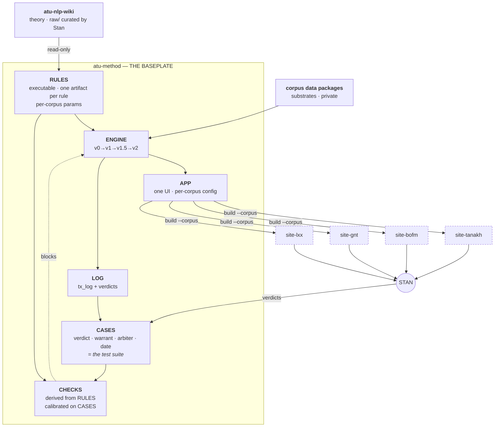

---
cssclasses:
  - wide
---

# Master proposal — deconstruct and rebuild onto a baseplate

> **Plain-language version.** Stan asked for the master plan: what does a properly-architected version of this whole program look like, given that we cannot currently trust our own gates and validators? This works from first principles — what components any system like this needs — then scores what we have against that list, answers his four specific questions (are validators skills? where does the web layer live? does each site need a repo? are the sites just manifestations of one engine?), and proposes a target with a gated migration. The headline finding is that **the rebuild is mostly finishing something that was already started and abandoned halfway**, which makes it far cheaper than a greenfield.

**Status: PROPOSAL. Nothing adopted.** Written 2026-08-09. Supersedes nothing; sits above [[4-process/proposal-loop-1.md|proposal-loop-1.md]], [[4-process/proposal-loop-2.md|proposal-loop-2.md]] and [[4-process/proposal-loop-3.md|proposal-loop-3.md]], which argued the *loop*. This argues the *structure the loop runs on*.

---

## Part 1 — What a system like this needs (the baseplate)

Derived from what the work actually is — a compilation from claims about language down to published editions — rather than from any existing repo.

| # | Component | What it must guarantee |
|---|---|---|
| 1 | **Sources** | Immutable, external, never written by us. Corpora and instruments. |
| 2 | **Theory** | Claims about language, with provenance and a falsification surface. |
| 3 | **Specification** | Rules as **executable artifacts** — one per rule, versioned, parameterised per corpus. |
| 4 | **Cases** | Adjudicated decisions carrying verdict, warrant, arbiter, date. Simultaneously the memory **and the test suite**. |
| 5 | **Engine** | One implementation that compiles spec + substrate → segmentation. |
| 6 | **Checks** | Derived from the spec, calibrated against the cases. |
| 7 | **Presentation** | One reading UI, N corpora. |
| 8 | **Publish** | Thin artifact targets, one per domain. |
| 9 | **Record** | What happened, replayable, enabling incremental lint. |
| 10 | **Governance** | Who may change what, and which gate each change passes. |

**The load-bearing relationship is 3 ↔ 4 ↔ 6.** A rule, the cases it decided, and the check that enforces it must be **one artifact with three faces**. If they are three separately-authored things, they can disagree, and nothing can tell you which is wrong. That is precisely Stan's stated problem: *"there is no guarantee that the gates and validators are correct."*

## Part 2 — Scoring what exists

Measured 2026-08-09, receipts inline.

| # | Component | State |
|---|---|---|
| 1 | Sources | ✅ **Strong.** BHSA, Macula/N1904, UD_Latin-PROIEL→TF banked and external. |
| 2 | Theory | ✅ **Exists**, in `atu-nlp-wiki`, with its own raw layer. |
| 3 | Specification | ❌ **Prose, re-implemented per repo.** [[1-method/binding-rules-hebrew.md|binding-rules-hebrew.md]] states rules in English; each reader re-implements them in Python. `readers-tanakh/scripts/build_books.py` (540 lines) and `readers-gnt/scripts/build_books.py` (462 lines) share **31 identical non-trivial lines** — same name, same job, diverged. |
| 4 | Cases | ❌ **Absent.** `readers-bofm/.../overrides.json`: 911 keys, **all 911 values bare lists**. No verdict, warrant, arbiter, or date. 911 adjudications, reasoning gone. |
| 5 | Engine | ⚠️ **Started and abandoned.** `atu_method/` is a real shared package — 21 modules (`adapters`, `english`, `kjv_alignment`, `parsing`, `swaps`, `infrastructure`) — imported by tanakh (10 files), bofm (5), gnt (4), and by **lxx and vulgate not at all**. It holds cross-cutting utilities; the **rule engine stayed per-repo and diverged.** |
| 6 | Checks | ❌ **75 validators, none meta-validated.** Written independently of the rules they enforce. |
| 7 | Presentation | ❌ **Duplicated.** ~92 HTML files built by separate per-repo builders. |
| 8 | Publish | ⚠️ **Works, but conflated with source.** Root `CNAME` per repo (`tanakh-reader.com`, `bomreader.com`, `gnt-reader.com`, `lxx-reader.com`) → GitHub Pages, one site per repo. Verified. |
| 9 | Record | ⚠️ **Half-built.** `atu_method/infrastructure/tx_log.py` already logs `{file, line, action, before, after}` per rule application, with rollback. It records *what changed*, never *why*. |
| 10 | Governance | ⚠️ **Prose only.** framework §7 is real and unenforced — §7.5 declared on 24% of canon-touching commits. |

**Five of ten absent or prose-only; three half-built.** And critically — **components 5 and 9 were started and stopped.** This is not a greenfield. It is finishing an abandoned direction, which is a materially different and cheaper proposition.

---

## Part 3 — Is the mental model right?

Stan's model: *llm-wiki supplies theory → atu-method transforms theory into rules & validators → each repo implements the rules to mechanically split/merge lines.*

**The spine is right.** It is a compilation pipeline, and naming it that way is the single most useful thing in this document. Two corrections:

### Correction A — "atu-method transforms theory into rules, **each repo implements**" is the defect

If it is a compilation, then **a rule should compile, not be re-implemented by hand five times.** Today a rule exists twice per corpus — once as English prose in a catalog, once as Python in a reader — and the two can drift with nothing detecting it. Five corpora means up to ten expressions of every rule.

The 31-shared-lines measurement is the proof: two files with the same name doing the same job have almost nothing in common. **A rule must be one artifact, parameterised per corpus, executed by one engine.**

### Correction B — validators are **not** skills, and the distinction is load-bearing

Stan asked: *"are those not basically skills?"* It is a sharp question and the answer is no — for a reason that matters more than terminology.

| | Nature | Determinism | Where it belongs |
|---|---|---|---|
| **Skill** | Procedure for an *agent* that exercises judgment | Non-deterministic — depends on the agent | The **v2 judgment residual** only |
| **Rule** | Transformation over a parse | Must run identically forever | The mechanical layer |
| **Validator** | Predicate over output | Same | Derived from the rule |

**Making a rule a skill would make correctness depend on the agent being sharp that day** — which is the exact failure this whole rebuild exists to remove. The mechanical layer must be agent-independent; that is the point of "mechanical-first."

**But the intuition underneath is correct**: a rule and its validator *are* the same knowledge facing two directions — *apply it* and *check it*. Today they are separately authored, which is why nothing guarantees they agree. **The fix is to make them two faces of one artifact.** And skills do have a home in this architecture: per-instance adjudication of judgment residuals, where a mind is genuinely required.

---

## Part 4 — The missing piece: the web layer

Stan is right that it is missing, and it is component 7. **Recommendation: not its own repo — part of the engine.**

**Why not a separate UI repo.** It would create a *third* cross-repo cascade: theory → rules → implementation → UI. Cross-repo cascade is the failure mode being removed, not a pattern to add another instance of. Every shared change would then need coordinated releases across seven repos.

**Why in the engine.** The reading UI has exactly one job — render ATU-segmented text — and what varies by corpus is configuration, not code: script direction (Hebrew RTL vs Greek/Latin/English LTR), fonts, transliteration toggles, apparatus layers, audio availability. That is a **config surface, not five applications.**

**What Stan actually asked for follows directly:** one cool UI idea → one edit in the app → rebuild all corpora → every site has it. Today that same idea is a five-repo cascade, hand-applied, with drift guaranteed and nothing checking consistency.

## Part 5 — Does each site need a dedicated repo?

**The constraint is real and verified**: each reader has a root `CNAME` and serves via GitHub Pages, which binds one custom domain to one repo. Five domains therefore need five Pages-serving repos.

**But they do not need to be *source* repos, and that distinction is the whole answer to Stan's deeper question.**

> *"consider whether each site actually needs a dedicated repo or if they're just all web-facing manifestations of YOU"*

**Yes — and that should become literally true.** Each site becomes a **publish target**: build output plus a `CNAME`, force-pushed by the engine's build. No rules, no validators, no generator, no [[CLAUDE.md]] persona, no independent history worth defending. The domain stays; the repo stops having opinions.

What that kills, all of which are current sources of pain: five diverging rule implementations; five validator sets that cannot be compared; the cross-repo cascade for any shared change; and the reader-Claude conversation partners that made Stan the message-carrier — because with no repo-specific logic there is nothing repo-specific to converse about.

---

## Part 6 — The target



```
   atu-nlp-wiki ──read-only──▶ ╔══════════ atu-method: THE BASEPLATE ══════════╗
                               ║  RULES ──▶ ENGINE ──▶ APP                     ║
   corpus data ────────────────║    │         ▲         │                      ║
   (substrates, private)       ║    ▼         ┊         │                      ║
                               ║  CHECKS ─────┘ blocks  │   LOG ──▶ CASES      ║
                               ║    ▲                   │            ▲         ║
                               ║  CASES (verdict+warrant+arbiter) ────┘        ║
                               ╚═══════════════════│═══════════════════════════╝
                                    build --corpus │
                     ┌──────────────┬──────────────┼──────────────┐
                 site-tanakh    site-bofm      site-gnt       site-lxx
                 (build output + CNAME only — no logic)
                                    │
                                  STAN ── verdicts ──▶ CASES
```

## Part 7 — How validators become trustworthy

Stan's core concern, answered directly. Three mechanisms, all structural:

1. **Single source.** The check is generated from — or paired in one artifact with — the rule. They cannot disagree about what the rule says, because there is one statement of it.
2. **Calibration assertions inside the script.** Every detector asserts a **known-good case it must find** and a **known-bad it must not**. Non-negotiable, and it is the thing that would have caught my own checker reporting "0 broken wikilinks" while the resolver was flagging them.
3. **Cases are the test suite.** A validator is correct **iff it agrees with the adjudicated cases**. This is the meta-validation that does not exist today in any form.

**And the honest limit:** mechanism 3 is only as good as the arbiter behind the verdicts. If cases are adjudicated by us against our own rules, this is circularity in a nicer container — which is exactly what the Isaiah oracle turned out to be. **The arbiter question is upstream of the entire rebuild.**

## Part 8 — Migration, gated

**Gate 0 — the arbiter question. Nothing is built before this is answered.**
Is there an external segmentation witness that our rules did not produce? Candidates: Masoretic **te'amim**, **Skousen's** manuscript-tradition lineation, **Marschall's** syllable bands. If none is adequate, **stop** — the system is additive by nature, and the correct response is to run it as such and skip the rebuild entirely. Cheap to answer, and it can terminate the whole plan.

**Then, in order, each step provable before the next:**
1. **Case schema**, plus backfill of whatever is recoverable. (Realistically little: the 911 overrides have no verdicts to recover.)
2. **Lift ONE rule end-to-end on ONE corpus** — executable spec, generated check, cases as tests, engine applies it. Prove the loop on the smallest possible surface.
3. Migrate the remaining rules corpus by corpus.
4. Unify the app; convert reader repos to publish targets **one at a time**, keeping each live site serving throughout.
5. Retire the old path on a date decided **in advance**.

## Part 9 — What this gets wrong

- **The unification assumes the corpora are more alike than they may be.** Hebrew with RTL and te'amim, Early Modern English over a weak parse, and Koine over Macula are genuinely different problems. **The 31-shared-lines figure I used as evidence of accidental divergence may instead be evidence that the divergence is justified** — and if so, one engine is the wrong shape and this proposal's spine is wrong.
- **Consolidation destroys the independently-authored gates.** Two days ago I argued those were non-negotiable, on evidence: `readers-bofm`'s pre-commit hook blocked a commit of mine while this repo's own checker passed with 103 dangling citations. Under this design, independence must come from calibration and adversarial sub-agents instead of from repo separation — and that is **genuinely weaker**. This is the strongest argument against the whole proposal and I have not solved it.
- **I am not neutral**, and the recommendation conveniently concentrates everything in the repo I work in.
- **Big-bang risk against four live sites**, with every validator baseline already stale, so regression control is weakest exactly where it is most needed.
- **It does not address the coordination surface** — 3 cascading [[CLAUDE.md]] files, 106 memories — which is a real part of what feels unmaintainable.
- **Gate 0 may fail**, in which case Parts 3–8 are wasted motion. That is deliberate — it fails cheap and early — but it should be expected, not treated as an edge case.
