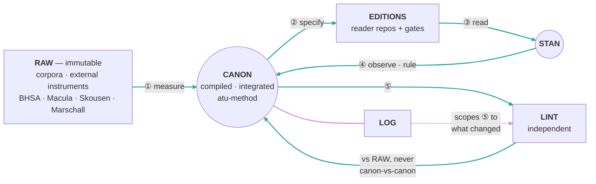

---
cssclasses:
  - wide
---

# Proposal Loop 1 — one loop, three organs (mine)

> **Plain-language version.** This proposes what the whole system's feedback loop should be: where the theory wiki sits, where I sit, where sub-agents sit, where the reader repos sit. The design test it holds itself to is Stan's: **an improvement anywhere must make the whole loop better.** If a fix stays local, the design is wrong — that is the difference between a system that gets more reliable and one that gets smarter.

**Status: PROPOSAL. Nothing adopted.** Written 2026-08-08 at Stan's request. Companions: [[4-process/proposal-loop-2.md|proposal-loop-2.md]] (adversarial critique of this) and [[4-process/proposal-loop-3.md|proposal-loop-3.md]] (an independently-derived alternative). Read all three before ruling.

Grounding: [[4-process/compounding-vs-additive.md|compounding-vs-additive.md]]; `meta-wiki/wiki/` — `compounding-artifact.md`, `ops-improvement-loop.md`, `lint-workflow.md`, `drift.md`, `schema-layer.md`, `growth-curve.md`.

---

## The design criterion: simplicity is the mechanism, not the styling

Karpathy's construction is three files and three verbs. That is not minimalism for taste — **it is why an improvement propagates.** A loop with few parts and one shared store has nowhere for a gain to get trapped: improve the store and every operation that touches it improves. A loop with many specialised parts and separate stores localises every gain, which is exactly how a system becomes busy without becoming better.

**So the test for every element below is: does an improvement here raise the floor everywhere?** If the honest answer is no, the element is decoration and this proposal should drop it. My first draft of this page failed that test — two loops, six ranked priorities, ten nodes — and is replaced by what follows.

**But simplicity is earned from the problem, never imposed on it** (Stan, 2026-08-08): *"if the complexities require a complex solution, so be it."* The failure mode on this side is real and I may have just committed it — collapsing my two-loop draft into three organs could have dissolved a distinction that was doing work, namely that some of our loops genuinely plateau and some can accelerate, which have opposite correct responses. So the criterion is two-sided, and the second half binds as hard as the first:

- **Drop a part** when removing it loses nothing but the part.
- **Keep a part** when removing it forces two genuinely different things to be treated as one.

A design is finished when every remaining part fails the drop test — not when it is short. [[4-process/proposal-loop-2.md|proposal-loop-2.md]] should attack this page from *both* directions: what is decoration, and what did over-simplifying throw away.

---

## The whole thing

**One circulation. Three organs. One store.**

| Organ | What it is here | What it answers |
|---|---|---|
| **LOG** | git history · retraction logs · `2-evidence/growth-data.csv` | *What happened?* |
| **LINT** | `loop_health.py` + `check_broken_pointers.py` (structural) · fresh-context sub-agents (semantic) | *What is wrong?* |
| **CANON** | `1-method/` + `2-evidence/` — the compiled store | *What do we know?* |



```
        RAW ──① measure──▶ ╔═══════════╗ ──② specify──▶ EDITIONS ──③──▶ STAN
     (immutable)           ║   CANON   ║                (+ gates)          │
              ┌──────⑤────▶╚═══════════╝◀───────────── ④ observe · rule ───┘
              │                  │
            LINT ◀── LOG ────────┘   (log scopes lint to what changed)
        (independent, arbitrated against RAW)
```

**The theory wiki** (`atu-nlp-wiki`) sits *upstream of RAW*: it compounds on its own scholarship layer, feeds CANON **read-only**, and is written to only by Stan curating its `raw/`. Nothing from the field writes back into it. A measurement that matures to publication rigor can be admitted to its `raw/` as a source — gated by Stan, needing no exception.

**Sub-agents are not a node.** They are how LINT gets performed, because it cannot be performed by me (below).

---

## The three organs — and the RAG connection

Stan's framing: these are the same three challenges RAG fails. Worth making explicit, because it says *why* each organ exists rather than just naming it.

**RAG re-derives.** Every query starts from chunks and rebuilds the answer; nothing accumulates, so the thousandth query costs what the first did. **CANON is the answer**: synthesis is compiled once and kept current, so the next question starts from what we already worked out. Our version of RAG's failure is re-deriving a segmentation judgment from the parse every time instead of consulting a rule that already settled it.

**RAG cannot tell you it is stale.** Retrieval returns the wrong chunk with total confidence and no error signal. **LINT is the answer**, and it is the load-bearing organ: the loop is positive feedback, so it amplifies whatever is in the store, errors included. Skip lint and the compounding does not slow — it reverses.

**RAG has no history.** There is no record of what was ingested, superseded, or retracted, so nothing can be audited or scoped. **LOG is the answer**, and it does two jobs: it makes claims attributable (lint's precondition — you cannot adjudicate a contradiction between two unsourced claims), and it scopes lint to *what changed since last time*, which is what makes a scheduled lint affordable rather than a full re-read.

**Where our compounding actually lives:** the binding-rule catalogs. A rule earned on Hebrew has a Greek analogue — ὅτι ↔ *ki* (B11), ὅς ↔ *ʾăšer* (B3) — so work on one corpus should make the corresponding rule on the next cheaper. That is interest on interest, and it is the one channel in this project that could genuinely accelerate. [[4-process/improvement-loops.md|improvement-loops.md]] already names it and correctly flags that **nobody has measured whether porting is cheaper than deriving**, and that [[memories/feedback_cross_corpus_convergence.md|feedback_cross_corpus_convergence.md]] forbids assuming it. Measuring it is the single most informative experiment available.

---

## How an improvement at any point carries through

This is the section the design lives or dies by. Four entry points, one shared store:

| Improve here | It propagates because | Everything downstream that lifts |
|---|---|---|
| **RAW** (better substrate — the parse) | every clause atom is derived from it | v1 atoms → rule firing → editions → what Stan sees → which observations he even *can* make |
| **CANON** (an integrated finding) | every future question starts from it | next measurement is cheaper; rules derived after it are better founded; ported rules inherit the correction |
| **LINT** (a calibrated detector) | it guards the store every other organ writes to | every future deposit is checked; errors stop being amplified; **and its findings are generative** — a gap becomes the next measurement |
| **SCHEMA** ([[CLAUDE.md]]) | it governs the agent performing all four operations | *every* subsequent operation, forever — this is the interest rate, which is why practitioners rank the schema above any content page |

**The diagnostic this gives us for free:** if a proposed fix does not appear in that right-hand column, it is a local repair, not an improvement to the loop. Most of what we have shipped in the last three days is local repair.

**And the failure runs the same way.** A bad rule in CANON propagates to every corpus that ports it; an uncalibrated detector in LINT manufactures work everywhere; a bloated SCHEMA lowers the rate on every future operation. Symmetry is the point — the same structure that spreads gains spreads rot, which is why LINT is not optional rather than merely advisable.

---

## Where each party stands

**`atu-nlp-wiki` — theory, upstream, write-protected from the field.** Self-containment is its trust anchor; a `findings/` back-channel is a hole in it, and closing the hole beats legalising it. Feeding CANON read-only also gives the findings→canon edge an owner, which today it lacks.

**`atu-method` — the store, and the loop-closer.** The only node with read access to both the theory and the measurements, so carrying a measurement into a rule change is its job.

**Me — integrator, never instrument.** I perform ①②④ and dispatch ⑤. What I cannot be is a second opinion on my own work: semantic checking by the author of the edits cannot see contradictions those edits created, because the author agrees with the new claim. Demonstrated twice in the meta-wiki and a third time here on 2026-08-08, when a finding I filed refuted a Gap in a document I maintain and I did not notice for hours.

**Sub-agents — the independence I cannot supply.** Two jobs, not to be conflated: *scheduled semantic lint* (fresh context, adversarial, reading from files alone, verdicts anchored to RAW) and *scale judgment* (per-instance adjudication inside a fixed rule, as a `Workflow`). Both require pasted receipts.

**Reader repos — editions, and gates I did not author.** On 2026-08-08 `readers-bofm`'s pre-commit hook blocked a commit of mine while `atu-method`'s own checker reported clean with 103 citations dangling. **Their prose can thin; their gates cannot.**

**Stan — authority, the only reader, never the transport.** Ratifies canon and schema changes, curates the wiki's `raw/`, supplies the observations only a reader can. He should not be carrying messages between sessions; that is the defect this exists to remove.

---

## What changes, ranked by how far the improvement travels

1. **Integration is part of filing.** A finding is not filed when a page appears in `2-evidence/`; it is filed when the pages it contradicts or refines have been revised in the same turn. *Travels furthest, costs nothing, and is the difference between depositing and earning.* Measured: **5.54 links per page against the meta-wiki's 12.85.**
2. **Build the English bidirectional filter** — a `Workflow` over the ~503 Isaiah over-merge candidates. *Unstalls the only loop that can compound; fails cheap if the English test rejects most candidates.*
3. **Scheduled independent semantic lint.** *The failure bearing. Cannot be me.*
4. **Budget the schema; every amendment names what it displaces.** 18,410 chars against the meta-wiki's 9,497, growing monotonically. *It is the rate.*
5. **Measure whether cross-corpus porting is actually cheaper than deriving.** *The one experiment that would tell us whether anything here compounds at all.*

**Topology is deliberately not on this list.** Whether we collapse to two conversation partners matters for Stan's message-carrying burden, which is real — but collapsing conversations does not make anything compound, and keeping four does not prevent it. Decide it after 1–3, when it is clear whether topology was ever the constraint.

---

## What this is most likely to have wrong

Stated in advance, so [[4-process/proposal-loop-2.md|proposal-loop-2.md]] has somewhere to start — and because I was wrong once already today on this material.

- **"Our claims are checkable against sources" may be overstated.** The GIGO correction exists precisely because Hebrew-anchored gold is *not* English ground truth. If no adequate arbiter exists for English idea-units, CANON cannot compound and the prior no-ingest-loop ruling was right.
- **Three organs may be too few** — the simplification could be hiding a real distinction, exactly as my two-loop draft hid one.
- **Link density may measure genre, not failure.** It was designed for short synthesis pages; [[1-method/framework.md|framework.md]] is a specification.
- **Sub-agent independence may be weaker than claimed.** Fresh context is not a different mind.
- **Item 1 may be unenforceable without becoming bureaucracy** — a mandatory cross-page edit invites cosmetic edits that satisfy a checker and integrate nothing.
- **The cross-corpus compounding channel may not exist.** If ported rules must be independently re-derived anyway (as [[memories/feedback_cross_corpus_convergence.md|feedback_cross_corpus_convergence.md]] requires), the saving may be near zero — and then this whole system is additive and should be run as such.
