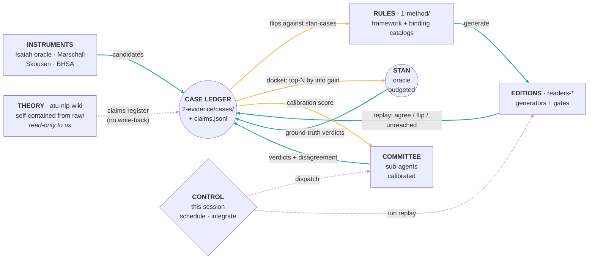

---
cssclasses:
  - wide
---

# Proposal Loop 3 — an independent alternative

> **Plain-language version.** Proposal 1 says: put everything in one store, and improvements spread because everything touches the store. This proposal says something different. The thing this project actually builds is not a library of writing — it is a *machine that cuts scripture into lines*. Machines get better the way software gets better: you keep a growing list of decided cases, and every time you change anything you re-run the whole list and look at what moved. That re-run is the loop. An improvement anywhere shows up as cases flipping, and you can count them. Nothing else here compounds; the list of decided cases does.

**Status: PROPOSAL. Nothing adopted.** Written 2026-08-08. Companion to [[4-process/proposal-loop-1.md|proposal-loop-1.md]] and [[4-process/proposal-loop-2.md|proposal-loop-2.md]]. This one was written to a deliberate method: the literature and the `meta-wiki` corpus were read *first*, the design was written down before [[4-process/proposal-loop-1.md|proposal-loop-1.md]] or [[4-process/compounding-vs-additive.md|compounding-vs-additive.md]] were opened, and only then was it differentiated. Where it converges with Proposal 1 it says so out loud, because disguised agreement is worth nothing and convergence from an independent start is evidence.

---

## 0. The one-sentence design

**The compounding artifact of this program is not a document store. It is a replayable ledger of adjudicated segmentation cases, and the loop is the replay.**

Every organ — theory wiki, canon, reader repos, sub-agents, Stan — is a *knowledge source* that writes cases to that ledger or is measured against it. An improvement at any point propagates by exactly one mechanism: **re-run the ledger, and read the flips.** That is not a metaphor about interest rates. It is a command with an exit code.

---

## 1. Why I landed somewhere other than a wiki

Karpathy's construction compounds because in that setting **the deliverable *is* the prose synthesis**. The gist's own framing, fetched 2026-08-08 from <https://gist.github.com/karpathy/442a6bf555914893e9891c11519de94f>: raw sources are immutable, the wiki is the LLM-owned compiled layer, `index.md` catalogues it, `log.md` is an append-only parseable history, and lint health-checks for contradictions, stale claims, orphans and gaps. When the product you ship is understanding, a better-integrated page *is* a better product.

That is not what this program ships. This program ships a function. Its own canon says so, verbatim:

> **Lens** — a deterministic function `lens(substrate) → segments` whose output is a corpus-wide rendered representation. The **ATU lens** is the v0 → v1 → v1.5 (→ v2 → v3) pipeline
> — `3-implementation/substrate.md:176-178`

A function does not compound through link density. It compounds through **a growing set of cases it is known to get right**, because that set is what makes every future change cheap to evaluate. Anthropic's own eval guidance states the mechanism plainly — "Their value compounds over the lifecycle of an agent… The value compounds, but only if you treat evals as a core component, not an afterthought," and "Converting user-reported failures into test cases ensures your suite reflects actual usage" (<https://www.anthropic.com/engineering/demystifying-evals-for-ai-agents>). The corpus-linguistics version of the same loop is older and closer to home: Pustejovsky & Stubbs' **MAMA cycle** (Model → Annotate → Model → Annotate) inside the larger MATTER cycle, in which draft annotation guidelines are pilot-annotated, the disagreements are inspected, and the *guidelines* are revised — the annotation is not the by-product of the spec, it is the instrument that corrects the spec (<https://books.google.com/books/about/Natural_Language_Annotation_for_Machine.html?id=QtzmqamXxx4C>; overview in Ide & Pustejovsky, <https://arxiv.org/pdf/1602.05753>).

This project is a MAMA cycle that has never closed. It has a model ([`framework.md`](../1-method/framework.md) §2.1/§2.2), it produces annotations at enormous scale, and it throws the annotations' *verdicts* away.

## 2. The evidence that the verdicts are being thrown away

This is the diagnostic the whole proposal rests on, so it is receipted.

**`overrides.json` — the largest body of adjudicated judgment in the program — records no judgment.**

```
$ cd readers-bofm && python -c "import json; d=json.load(open('data/text-files/v2-adjudicated/overrides.json',encoding='utf-8')); \
  print('keys:',len(d)); print('value types:',set(type(v).__name__ for v in d.values())); \
  print('non-list keys:',[k for k,v in d.items() if not isinstance(v,list)][:10])"
keys: 911
value types: {'list'}
non-list keys: []
```

911 verses of human-and-LLM adjudication, stored as *the resulting lines only*. No verdict, no rule cited, no adjudicator, no date, no what-it-replaced. It cannot be replayed, cannot be audited, cannot be attributed, and cannot tell you whether a rule change agrees with it.

**The project already knows how to do it right — in exactly one file.** `cross-verse-merges.json` carries a `warrant` field per merge:

```
$ python -c "import json; d=json.load(open('data/text-files/v2-adjudicated/cross-verse-merges.json',encoding='utf-8')); \
  print(d['merges'][0]['first_ref'], '|', d['merges'][0]['warrant'][:90])"
alma 37:3 | Verse 3 is a topic-fronted NP with three stacked relative clauses and no finite predicate
```

**The gold yardstick is a case set with the case fields removed.**

```
$ python -c "import json; d=json.load(open('private/substrate/emode-substrate/bofm-atu-gold-yardstick.json',encoding='utf-8')); \
  print(len(d), sorted(d[0].keys())); print(d[0]['ref'], d[0]['genre'])"
177 ['genre', 'gold_lines', 'ref']
1nephi 13:18 SPRAY_PARALLEL_STACK
```

Ref, genre, gold lines. No criterion cited, no adjudicator, no date, no link to the rule the case tests.

**The richest feature extraction in the program has no verdict column.**

```
$ python -c "import json; d=json.load(open('data/parses/audit/lever2-purethat-enriched.json',encoding='utf-8')); \
  print('n=',len(d)); print('has verdict:', any('verdict' in k for k in d[0]))"
n= 343
has verdict: False
```

**And nothing anywhere replays.** Verified negative, this turn:

```
$ cd atu-method && grep -rn "_generate\.py\|build_books" scripts/ atu_method/ ; echo "(exit $?)"
(exit 0)          # zero matches — atu-method has never invoked a reader generator
$ grep -rln "replay\|case-ledger\|case_ledger" scripts/ 1-method/ 2-evidence/ 3-implementation/ 4-process/
                  # zero matches
```

Every reader repo *has* a generator entrypoint — `readers-bofm/5-machinery/scripts/bofm_generate.py`, `readers-lxx/scripts/lxx_generate.py`, `readers-vulgate/scripts/vulgate_generate.py`, `readers-tanakh/scripts/build_books.py`, `readers-gnt/scripts/build_books.py`. The hub has never called one.

**So the diagnosis is not "we aggregate findings instead of integrating them."** It is narrower and more actionable: *we produce thousands of adjudications a year and persist only their output, never their verdict, so no change to any part of the system can be evaluated against what we already decided.*

## 3. The unit of account — the CASE

One record type. JSON Lines, one file per corpus, at `2-evidence/cases/<corpus>.jsonl`.

```json
{"case_id": "bofm/alma-33:1/s06",
 "corpus": "bofm",
 "ref": "alma 33:1",
 "site": {"after_token": 6, "left": "they sent forth unto him,", "right": "desiring to know whether they should believe in one God,"},
 "verdict": "BREAK",
 "criterion": "framework#§2.1",
 "rule": "cognition-frame-participial",
 "basis": "forward closure via EME elided-object idiom; backward containment via chain-continuity",
 "authority": "stan",
 "date": "2026-05-27",
 "supersedes": null,
 "instrument": null,
 "sub_pattern": null}
```

Six things make this the right unit, and each is load-bearing:

1. **The site, not the verse.** A verse is not a decision; a *boundary site between two adjacent candidate cola* is. This is what makes a case a distinct event — which, as §7 shows, mechanically fixes a defect the retraction protocol already has.
2. **`verdict` ∈ {BREAK, KEEP, MERGE-UP}** — the thing `overrides.json` discards.
3. **`criterion` is a canon anchor**, so a case is bound to the clause that licensed it. When §2.1 moves, a query finds every case that cited it.
4. **`authority` ∈ {stan, committee, rule, oracle-candidate}** — the trust gradient, in a field. `stan` verdicts are ground truth; `rule` verdicts are *derived* and may be overwritten silently; `oracle-candidate` is an unfiltered instrument output (the Isaiah 503) and is **never** a verdict until promoted.
5. **`supersedes`** makes revision a first-class act rather than an edit. Cases are append-only; the ledger *is* the log.
6. **`sub_pattern`** is the existing retraction-log taxonomy key, verbatim, so retractions and cases are the same schema.

**Seeding is backfill, not new work.** Everything above already exists on disk:

| Source | Count | Becomes |
|---|---|---|
| `readers-bofm/.../overrides.json` | 911 verses | `authority: committee` cases (verdicts recoverable by diffing v2 vs v2-adjudicated) |
| `readers-bofm/.../bofm-atu-gold-yardstick.json` | 177 verses | `authority: stan` |
| `readers-bofm/research/isaiah-gold/*.json` | 395 verses (48/301/30/16, counted 2026-08-08) | `authority: oracle-candidate` |
| `readers-bofm/data/parses/audit/lever2-purethat-enriched.json` | 343 sites | unresolved cases awaiting a docket |
| `.../cross-verse-merges.json` | 3 merges | `authority: stan`, `basis` already written |
| `readers-*/retraction-log.md` | 31 entries | superseding cases with `sub_pattern` populated |

That is a few thousand seeded cases against a BoFM corpus of **16,004 deployed ATU nodes** (`3-implementation/substrate.md:106`) — a small sample, which §12 treats as this design's most likely failure.

## 4. The architecture — a blackboard, not a store

The right prior art here is not the wiki. It is the **blackboard model**: a set of independent knowledge sources that cannot talk to each other, one shared structure they all read and write, and a control component that decides what to work on next (Nii, "The Blackboard Model of Problem Solving and the Evolution of Blackboard Architectures," *AI Magazine* 7:2, <https://onlinelibrary.wiley.com/doi/abs/10.1609/aimag.v7i2.537>; the original is Hearsay-II, <https://websites.nku.edu/~foxr/CSC425/hearsay2.pdf>). That is a literal description of this program's topology: five reader repos, a canon hub, a self-contained theory vault, N stateless sub-agents, and one human who is not a message bus.



Colour key — **teal**: writes into the ledger (every knowledge source). **amber**: the ledger's three outputs, which are the only way anything learns. **violet**: control and the read-only theory coupling.

Plain-text version:

```
        THEORY (atu-nlp-wiki) ·········· read-only ··········┐
        self-contained from raw/                             ┊ claims register
                                                             ▼
   RULES ──generate──▶ EDITIONS ──replay──▶ ╔═══════════════════════════╗
   1-method/           readers-*            ║      CASE LEDGER          ║
      ▲                 + gates             ║  2-evidence/cases/*.jsonl ║
      │                                     ║  + claims.jsonl           ║
      │  ⑥ flips against stan-cases         ╚═══════════════════════════╝
      └───────────────────────────────────────┘ │ │ │
                                                │ │ └── ⑧ calibration ──▶ COMMITTEE (sub-agents)
   INSTRUMENTS ──candidates──▶ (ledger)         │ └──── ⑦ docket ───────▶ STAN (budgeted oracle)
   Isaiah oracle · Marschall · Skousen          └────── replay report ──▶ CONTROL (this session)

   CONTROL dispatches the committee and runs the replay. It never writes a verdict.
```

**Read the diagram as a scheduler, not a pipeline.** There is no "flow" from raw to product. There is a shared structure, five writers, and a control component whose only job is deciding *what to work on next* — which in a blackboard system is the whole intelligence of the design.

## 5. The three verbs

Three commands replace the three organs. Each is a real script with a real exit code.

| Verb | Script | What it does | Cadence |
|---|---|---|---|
| **`replay`** | `scripts/replay.py <corpus>` | Regenerate from current rules; for every case emit `AGREE` / `FLIP` / `UNREACHED`. Exit non-zero on any FLIP against an `authority: stan` case. | Every canon-touching commit; nightly per corpus |
| **`docket`** | `scripts/docket.py --budget 20` | Select the N unresolved sites whose resolution resolves the most other sites. Writes `Current-Docket.md`. | Weekly |
| **`promote`** | `scripts/promote.py` | Turn a resolved docket into cases; turn a repeated flip-class into a rule proposal; turn a 3-strike `sub_pattern` into a discipline promotion. | On docket close |

**`replay` is the loop.** Everything else in this design exists to feed it or read it.

## 6. Position on log, lint, and compounding — where I take a different line

Stan framed these as the same three challenges RAG fails. Proposal 1 maps them one-to-one onto three organs: LOG = history, LINT = error signal, CANON = compiled synthesis. That mapping is clean and I think it is wrong in one specific way that matters.

**They are not three challenges. They are one challenge observed at three latencies.** The thing RAG lacks is not memory, not history, and not synthesis. Retrieval systems can be given all three and still fail to accumulate. What they lack is a **write path that carries a verdict** — a channel by which the system can be told *it was wrong about this specific thing* in a form that binds its future behaviour. The 2026 literature converges on this without quite naming it: RAG "cannot update state, it retrieves based on similarity rather than truth, and it lacks a sense of time" (<https://atlan.com/know/ai-memory-system-vs-rag/>); the survey literature on agent memory frames the fix as a manager that decides *when to write*, not merely what to read (<https://arxiv.org/html/2603.07670v1>).

So my position, stated flatly:

- **The LOG is the ledger's input tape.** It is not a separate organ. A case with `supersedes` populated *is* a log entry; a log without verdicts is a diary, and a diary is what `overrides.json` currently is.
- **LINT is a degenerate replay** — a replay whose "generator" is the link graph and whose "cases" are structural invariants. `check_broken_pointers.py` and `loop_health.py` are already this; they are just replaying a much weaker case set. That is a demotion of lint relative to Proposal 1, and it is deliberate: lint answers *is the store self-consistent*, replay answers *is the store still right about the world*. The second question strictly contains the first for anything the ledger covers, and only the second can catch a rule that is internally coherent and empirically wrong.
- **Compounding is not an organ at all.** It is what the replay *measures*. If the replay's cost per decided case falls while its coverage rises, the system compounds. If not, it does not, and no amount of filing prose will change that.

**The deeper frame is falsification, not memory.** Platt's strong inference — "Devising alternative hypotheses; Devising a crucial experiment… each of which will, as nearly is possible, exclude one or more of the hypotheses; Carrying out the experiment so as to get a clean result; Recycling the procedure" (<https://courses.cs.duke.edu/fall04/cps296.2/science_platt.html>) — is the shape a segmentation methodology should have, and a case is the smallest possible crucial experiment. Argyris & Schön supply the second axis: single-loop learning corrects the action, double-loop "question[s] and modif[ies] the underlying assumptions, goals, and norms that led to those actions" (<https://en.wikipedia.org/wiki/Double-loop_learning>). Mapped here:

- **Single loop** — a case flips; fix the segmentation. (`overrides.json` is a pile of single-loop fixes.)
- **Double loop** — a *class* of cases flips; the rule was wrong; change §2.1. (This is Loop 1, and it does run.)
- **Third loop, which nothing here currently has** — the ledger's own selection is wrong; we have been adjudicating the wrong sites. Only the docket exposes this, by making visible how many cases were decided per unit of Stan.

## 7. How an improvement at any single point propagates

This is the design test, and the answer is a single mechanism rather than a table of hopes: **there is one currency and one replay, so every improvement is expressed as flips over the same ledger and is therefore comparable, measurable, and cross-corpus by construction.**

| Improve here | Concretely | Propagation, mechanically |
|---|---|---|
| **Substrate** (the parse) | restart UD corrections to `readers-bofm/data/parses/v0-cache-conllu/` | `replay bofm` re-derives every case from the new parse. Flips against the 177 stan-cases are regressions; agreements on previously-`UNREACHED` cases are the ceiling rising. The Isaiah oracle's F1 0.561 becomes a *tracked series* instead of a one-off |
| **A binding rule** | add or amend a rule in `1-method/binding-rules-hebrew.md` | `replay tanakh` before commit. The rule's value is `newly-AGREE minus newly-FLIP`, not a validator tick — which is precisely the over-merge signal the canon says validators are blind to |
| **The criterion** (§2.1/§2.2) | the ruled-but-gated non-finite-predication change (G1 in [[Current-Tasks.md]]) | Every case carries `criterion`. Query the ledger for cases citing `framework#§2.1`, replay with the change in and out, and the yardstick measurement §7.3 already demands is a diff of two replay reports rather than a bespoke study |
| **Theory** (`atu-nlp-wiki`) | a thesis-lens shift | `claims.jsonl` binds each of the 37 inventoried framework assertions to its cases. A lens shift marks every case decided under the old lens `stale` — this is the wiki's own **re-adjudication obligation** (`atu-nlp-wiki/admin/maturation-loops.md:40`), executed on our side as a query rather than a resolution |
| **A sub-agent spec** | tighten a dispatch prompt | The committee is scored against held-out stan-cases. A better spec shows up as a higher agreement rate on the same held-out set. Sub-agent quality stops being a matter of opinion |
| **The schema** ([[CLAUDE.md]]) | budget it; amend it | **The schema's fitness function is committee calibration.** The schema governs the agents; the agents' agreement with held-out Stan verdicts is the only observable that changes when the schema changes. This is what makes "the schema is the interest rate" checkable instead of a metaphor |
| **The docket selector** | better information-gain estimate | Same Stan budget resolves more downstream cases. Directly moves the auto-decided fraction |

**Three propagation consequences worth naming separately, because they fix things that are currently broken:**

**(a) The retraction loop starts firing, mechanically.** [[4-process/improvement-loops.md|improvement-loops.md]] records 31 retraction entries and zero promotions, and diagnoses the counting defect: pooling across repos "counts log entries rather than distinct events and inflates a single mistake up to threefold" (`improvement-loops.md:145`). A case is a distinct event *by construction* — keyed `corpus/ref/site`. A cascaded canon change logged in three repos produces one case per affected site, not three per repo. `promote` runs `GROUP BY sub_pattern` over structured fields instead of grepping prose, which is the exact failure recorded in [[4-process/collapsed-maturation-loops.md|collapsed-maturation-loops.md]]'s error table ("grepped prose for a phrase when the logs carry a structured `**Sub-pattern:**` field", `collapsed-maturation-loops.md:127`).

**(b) Two open canon questions become queries.** [[2-evidence/framework-claim-inventory.md|framework-claim-inventory.md]] flags assertion #6 — "(A) does the overwhelming majority of the work" — as `[UNPROVEN]`, "no ratio given anywhere; trivially measurable and never measured" (`framework-claim-inventory.md:40`). With `criterion` on every case, that ratio is a one-line count and it recomputes on every replay. Assertion #4, the hinge claim that grammatical closure proxies for thought, gets `cases: []` — visibly inert, which is the honest status and currently invisible.

**(c) The substrate loop's missing filter stops being a project.** [[2-evidence/finding-substrate-loop-diagnosis.md|finding-substrate-loop-diagnosis.md]] identifies the one absent component: the English bidirectional filter over ~503 Isaiah over-merge candidates. Under this design the 503 are already in the ledger as `authority: oracle-candidate`, the filter is a `docket` run with a fixed adjudication rule, and its output is cases. It becomes the ledger's *first customer* rather than a separate build with its own bespoke plumbing.

**And the failure propagates the same way** — a bad stan-case poisons every future replay, and because stan-cases are blocking, one wrong ground-truth verdict can freeze a correct rule change. §12 treats this as the design's central risk.

## 8. What compounds, what merely adds, and how you tell

**The test:** does item N make item N+1 cheaper or better? If yes, compounding. If no, additive — and additive is often fine.

**Additive here, and correctly so:** canon prose, memories (36 + 70), retraction entries, deployed verses, commits, documentation pages. Each is worth its cost; none makes the next one cheaper. Do not push a loop that has closed its error classes; a plateau there is success.

**Compounding here, if and only if the ledger runs:** the case set, because it is the thing that makes every subsequent change to anything evaluable in minutes rather than weeks.

**Four instruments, all computed by `replay` and `docket` for free.** These replace link-density, which Proposal 1 itself concedes "may measure genre, not failure" — a concession I think is correct, and fatal for that metric on a repo whose largest page is a specification.

| Metric | Definition | Compounding signature |
|---|---|---|
| **Auto-decided fraction** | of sites in the ledger, share decided by `authority: rule` and agreeing with the nearest stan-case | rises |
| **Stan-verdicts per shipped rule** | ground-truth adjudications consumed per rule that survives replay | **falls** — the sharpest signal, because it is literally the cost of the next unit of knowledge |
| **Transfer coefficient** | port a Hebrew binding rule to Greek unchanged; fraction of Greek cases it decides correctly *before* any Greek-specific tuning | > 0 means cross-corpus porting is real |
| **Coverage** | fraction of the 16,004 BoFM ATU nodes (and per-corpus analogues) reachable by any case | rises, or the other three are measuring a corner |

The transfer coefficient deserves emphasis: it is the same experiment Proposal 1 ranks fifth ("measure whether cross-corpus porting is actually cheaper than deriving"), and this design makes it **a by-product of the ledger rather than a study**. [[memories/feedback_cross_corpus_convergence.md|feedback_cross_corpus_convergence.md]] forbids *assuming* transfer; it does not forbid measuring it, and a coefficient is exactly the form in which "earn the convergence" becomes a number.

Two anti-gaming notes, because both metrics are gameable and I would rather say so than have Proposal 2 find it: the auto-decided fraction rises trivially if you add permissive rules, so it is only meaningful **jointly with** flips-against-stan-cases held at zero; and coverage rises trivially by seeding easy sites, so the docket must select by information gain, never by convenience.

## 9. Where everybody sits

**`atu-nlp-wiki` — theory, self-contained, read-only to us, coupled by a claims register.**
I converge with Proposal 1 on write-protection and I want to be explicit that this is convergence, not agreement borrowed: I reached it from the wiki's own constitution before reading Proposal 1, and the wiki session has *already executed it*. Verified this turn:

```
$ ls C:/Users/bibleman/work/atu-nlp-wiki/findings/
ls: cannot access '.../findings/': No such file or directory
$ ls C:/Users/bibleman/work/atu-nlp-wiki/admin/maturation-loops.md
-rw-r--r-- 1 bibleman 197121 6493 Aug  8 11:25 .../admin/maturation-loops.md
```

Where I differ: Proposal 1 puts the wiki "upstream of RAW" and treats the coupling as a read pipe. I think a read pipe is too weak, because it gives a theory claim no way to be wrong. My coupling is `2-evidence/claims.jsonl` — seeded from the 37 rows already inventoried — mapping *framework assertion ↔ wiki theory page ↔ cases*. No write ever enters the wiki. But a theory claim that names no cases is marked **inert**, and a claim whose cases now flip is marked **stale**. The wiki keeps its self-containment; the theory acquires a falsification surface it does not currently have. This is the atu-method side of the wiki's own re-adjudication obligation, and it is the honest reading of what "atu-method is the loop-closer" has to mean if it means anything.

**`atu-method` — the blackboard and the control component.** Holds `cases/`, `claims.jsonl`, the three scripts, and the canon. It is the only node with read access to both theory and measurements, which is why the ledger lives here and not in a reader repo.

**Me — control, never oracle.** I schedule, dispatch, integrate, and run replays. **I am forbidden from writing an `authority: stan` case**, and I may not adjudicate a docket I selected. This is stronger than Proposal 1's "integrator, never instrument," and it is stronger for a specific reason: the author-blindness result is not about semantic lint in particular, it is about *any* verdict issued by the party that framed the question. Making it a field constraint (`authority` is set by the writer, and I cannot write that value) turns a discipline into a schema rule.

**Sub-agents — a calibrated committee, not a lint crew.** This is my sharpest structural difference from Proposal 1. Sub-agents are not "how LINT gets performed"; they are independent adjudicators whose **disagreement is the scheduling signal**. Query-by-committee is the standard formulation: select the instance "where there is maximal disagreement among the committee members," measured by vote entropy (survey: <https://arxiv.org/pdf/2210.10109>). Three consequences: (i) a site three agents split on goes to Stan, a site they agree on becomes a `committee` case; (ii) each agent carries a running agreement score against held-out stan-cases, so "dispatched agents have been wrong before" becomes a number rather than a worry; (iii) the annotation literature's finding that disagreement is *signal about the item*, not just noise about the annotators (Uma et al., "Learning from Disagreement: A Survey," JAIR 72, <https://jair.org/index.php/jair/article/view/12752>) means high-disagreement sites are exactly where §2.1 is underspecified — the committee is a **criterion-defect detector**, which nothing in this program currently is.

**Reader repos — executors, gates, and replay targets.** Their prose can thin; their gates must not. I converge with Proposal 1 here entirely and for the same evidence (`readers-bofm`'s hook blocked a commit while `atu-method`'s own checker reported clean). The addition: each reader gains a `replay` entrypoint over its existing generator, which is the only new integration burden this design imposes on them.

**Stan — a budgeted oracle, never transport.** Concretely: **20 adjudications per week**, delivered as `Current-Docket.md`, each one a site with left/right text, the committee's split, and the candidate criterion. He is asked to *decide*, never to *review*. He continues to rule on canon and to curate `raw/`. The reason for a hard budget is not politeness: it is that an unbudgeted oracle cannot be optimised against, and the whole third loop (§6) depends on measuring decisions-per-Stan-hour.

## 10. What to build, in order

Deliberately three items, deliberately smaller than they look, because everything is backfill.

1. **`scripts/case_ledger.py`** — backfill from the six sources in §3. No new judgment; a transcription. Output: `2-evidence/cases/{bofm,tanakh,gnt,lxx,vulgate}.jsonl`. *Failure is cheap and informative:* if the 911 overrides cannot be recovered into sites and verdicts by diffing v2 against v2-adjudicated, the ledger's whole premise is weaker than claimed and we learn that in a day.
2. **`scripts/replay.py bofm`** — one corpus first, over the existing `bofm_generate.py`. Emits the flip report; wired as a pre-commit gate on canon paths. This is the loop; nothing else matters until it runs once.
3. **`scripts/docket.py --budget 20`** — the committee dispatch and the selection. Its first docket should be drawn from the 503 Isaiah over-merge candidates, which makes build 3 and the substrate loop's missing filter the same piece of work.

**Explicitly deferred:** the other four corpora (replay tanakh next, since it has gold substrate and the strongest transfer-coefficient signal); `promote.py` (until the ledger has enough flips to group); and any topology change. On topology I differ from Proposal 1's deferral by having a reason rather than a wait: **under this design the two-partner question loses most of its force**, because the message Stan currently carries between sessions becomes a docket file and a replay report. Decide topology after build 2, when the message volume is observable.

## 11. On simplicity — where I hold the line and where I refuse to

Stan's criterion: elegance is a mechanism, not styling, *but* "if the complexities require a complex solution, so be it." I read that as licensing complexity exactly where the domain has it, and nowhere else.

**Held simple, on purpose:** one record type, three verbs, one file format, plain JSON Lines in git. No database, no index, no service. The ledger is greppable and diffable, which means it survives tool handover and is auditable by reading.

**Refused simplifications, each with its reason:**

- **Per-corpus ledgers and per-corpus replay, not one global ledger.** Five corpora with different substrates (BHSA gold / Macula gold / UD-PROIEL gold / partial LXX / below-parity EModE) and different marker registries. A single global ledger would silently mix a Hebrew-anchored verdict with an English site — which is precisely the GIGO error the canon already paid for and recorded (`3-implementation/substrate.md:46-51`).
- **`authority` as a four-value gradient, not a boolean.** Collapsing `oracle-candidate` into `rule` re-imports the same GIGO error at the schema level. Collapsing `committee` into `stan` makes the auto-decided fraction meaningless.
- **Both a case ledger and a claims register.** They look mergeable and are not: a case is about a site in a text, a claim is about the framework. Merging them would make "which theory claims are inert" unaskable.
- **Cases are append-only with `supersedes`, not mutable rows.** Mutability would make the ledger unable to answer "when did we change our mind, and what forced it" — which is the one question the retraction protocol exists to answer.

Four refusals is more complexity than Proposal 1's three organs. I think each earns its place by the drop test Proposal 1 states correctly: removing it forces two genuinely different things to be treated as one.

## 12. Where this differs from Proposal 1, and why

| Dimension | Proposal 1 | Proposal 3 | Why the difference matters |
|---|---|---|---|
| **What compounds** | CANON, the compiled prose store (`1-method/` + `2-evidence/`) | the case ledger | The deliverable is a function, not a synthesis. Prose integration cannot be verified; case flips can |
| **Propagation mechanism** | one shared store — improve it and everything touching it improves | one shared **replay** — improve anything and re-run the ledger | A shared store propagates *potential*; a replay propagates *actual* and produces a number |
| **The load-bearing organ** | LINT ("the failure bearing") | REPLAY; lint is demoted to a degenerate replay over structural invariants | Lint asks *is the store self-consistent*. Replay asks *is it still right about the world*. Only the second catches a coherent, wrong rule |
| **log/lint/compounding** | three organs, mapped one-to-one | one problem at three latencies; the missing thing is a **falsification channel**, not memory | Frames RAG's failure as epistemic rather than architectural — and that frame is what makes `verdict` the required field |
| **Metric** | links-per-page (5.54 vs 12.85) | auto-decided fraction; Stan-verdicts-per-rule; transfer coefficient; coverage | Proposal 1 concedes link density may measure genre. All four of mine are decision economics and none is genre-sensitive |
| **Sub-agents** | how LINT gets performed | a **calibrated committee** whose disagreement schedules Stan and whose agreement scores itself | Turns "agents have been wrong before" into a tracked number, and makes disagreement a criterion-defect detector |
| **Stan** | authority, only reader, observes and rules | budgeted **oracle**: 20 adjudications/week selected by information gain | Makes the scarcest input optimisable. Proposal 1 removes his transport burden; this also spends what remains well |
| **Theory wiki** | upstream of RAW, read-only pipe | read-only *and* coupled by `claims.jsonl`, so a theory claim can be marked inert or stale | A read pipe gives theory no way to be wrong. Cases give it one without ever writing to the wiki |
| **First build** | integration-as-filing discipline (free), then the English filter | the ledger, then replay; the English filter becomes the ledger's first customer | Same target, opposite order: I want the instrument before the study |
| **Topology** | deferred, "decide after 1–3" | deferred, but *because* the design converts message-carrying into files, which is testable after build 2 | Different reason, same deferral |

**Where I converge with Proposal 1, stated plainly because it is evidence:**

- **The theory wiki is write-protected from the field, with `raw/` graduation as the only path in.** Reached independently from the wiki's constitution; already executed on the wiki side 2026-08-08.
- **The main session cannot be a second opinion on its own work.** Same conclusion, and I make it a schema constraint (`authority` is not mine to write) rather than a discipline.
- **Reader gates must stay strong and independently authored.** Same conclusion, same evidence, no addition.
- **Ground truth must be external, never canon-vs-canon.** Same conclusion; my `authority` gradient is that principle in a field.
- **Cross-corpus porting is the one channel that might genuinely compound and nobody has measured it.** Same conclusion; I disagree only about how expensive it is to measure.

**One live example of why I think the store model under-delivers, found while writing this.** `improvement-loops.md:259` currently asserts: *"That vault now carries a pilot `findings/` class, and its first entry is the readers-bofm Marschall measurement…"*, and `Pending-Decisions.md:19` asserts *"Verified 2026-08-08: `findings/F-001-marschall-1ne3.md` is still present, `admin/maturation-loops.md` was never created."* Both are false as of this turn — the folder is gone and `maturation-loops.md` exists (timestamped `Aug 8 11:25`). Two atu-method documents are stale against a sibling vault's executed decision, hours later. This is exactly the drift Proposal 1's LINT is designed to catch, and it is a fair point *for* Proposal 1 on the prose layer — see §14. But it also shows the limit of a prose store as the compounding artifact: nothing about the store makes staleness *automatically* observable, whereas a replay report is stale-or-not by construction.

## 13. What this design is most likely to have wrong

- **The ledger may make the past authoritative, and that is a double-loop failure.** This is the one that worries me most. Blocking on flips against stan-cases means old verdicts constrain new criteria. Concretely: [[4-process/collapsed-maturation-loops.md|collapsed-maturation-loops.md]] records that Stan "denied both promotions I drafted because he saw they'd entrench the rejection of *breath*, one day before he proposed making breath near-definitional" (`collapsed-maturation-loops.md:67`). A ledger seeded under the current criterion, with blocking gates, would have made that reframe *maximally expensive* — it would have flipped hundreds of cases and read as catastrophic regression. Any implementation needs a first-class `criterion-shift` operation that marks cases stale rather than violated, and I do not currently know how to keep that from becoming an escape hatch that dissolves the gate.
- **Case identity may not be stable.** A site keyed on token offset breaks when the parse or the text changes, and `UNREACHED` could swamp the report — the snapshot-test rot problem. If most cases go unreached after any substrate change, the replay is theatre.
- **The sample may be too thin to be informative.** A few thousand seeded cases against 16,004 BoFM ATU nodes plus four other corpora is a small fraction, weighted toward Isaiah and toward whatever the yardstick sampled. Flip counts on a biased sample can be confidently wrong in the way the meta-wiki's lossy-summary drift is confidently wrong.
- **I have not verified that the reader generators are invocable from the hub.** I verified only that they exist and that atu-method has never called one. Substrate is gitignored per-repo (`private/substrate/`), and a replay that cannot reconstruct inputs is not a replay. This is the single biggest unverified assumption in the proposal and it should be tested before anything else is built.
- **The committee's independence may be as weak as Proposal 1 fears.** Fresh context is not a different mind; three agents from the same model with the same schema may agree wrongly and *in unison*, which would make low disagreement a false all-clear — worse than no signal, because it looks like consensus.
- **This design adds machinery, and machinery is what this repo is already drowning in.** Three scripts, two new file types, a weekly cadence — against a repo whose own board lists seven standing failures nobody is assigned to. The honest risk is that the ledger becomes the eighth.

## 14. What Proposal 1 gets right that this does not

- **The prose layer is real, it drifts, and my replay does not touch it.** The stale claims I found in §12 are prose drift in atu-method's own documents. Replay cannot see them. Proposal 1's scheduled, independent, fresh-context semantic lint is the correct instrument for that layer, and my design has no substitute — it would need Proposal 1's LINT bolted on, which is an admission that three organs may be the right count for the documents even if the ledger is the right shape for the decisions.
- **"Integration is part of filing" is free and mine is not.** Proposal 1's top-ranked change is a discipline, costs one turn, and would have prevented the Gap-3 contradiction it describes. My top-ranked change is a build. Ranked by leverage-per-cost, Proposal 1 wins its first item outright.
- **The schema-budget observation is measured and actionable today.** 18,410 chars against the meta-wiki's 9,497, growing monotonically, with every amendment naming what it displaces — that is a concrete, checkable intervention available this week. My design *adds* to the schema and offers only an indirect fitness function for it.
- **Proposal 1's simplicity criterion is better stated than mine.** "Drop a part when removing it loses nothing but the part; keep a part when removing it forces two genuinely different things to be treated as one" is the cleanest formulation of the two-sided test in any of these documents, and I used it in §11 rather than improving on it.
- **Proposal 1 correctly identifies that its own weakest point is the arbiter problem** — that if no adequate ground truth exists for English idea-units, nothing here compounds. My design does not solve that; it merely makes the missing arbiter *visible* as a column of `authority: stan` cases that nobody can fill.

---

## Related

- [[4-process/proposal-loop-1.md|proposal-loop-1.md]] — the design this one differs from
- [[4-process/improvement-loops.md|improvement-loops.md]] — the six loops and their measured status; §7(a) here proposes the mechanical fix for Loop 2
- [[4-process/compounding-vs-additive.md|compounding-vs-additive.md]] — the shape distinction, and the link-density instrument this proposal replaces
- [[2-evidence/finding-substrate-loop-diagnosis.md|finding-substrate-loop-diagnosis.md]] — the missing filter, here recast as the ledger's first docket
- [[2-evidence/framework-claim-inventory.md|framework-claim-inventory.md]] — the 37 assertions that seed `claims.jsonl`
- [[4-process/retraction-log-protocol.md|retraction-log-protocol.md]] — the `sub_pattern` taxonomy the case schema reuses verbatim
- `atu-nlp-wiki/admin/maturation-loops.md` — the theory side's own already-executed layered model
- `meta-wiki/wiki/` — `compounding-artifact.md`, `ops-improvement-loop.md`, `lint-workflow.md`, `drift.md`, `schema-layer.md`, `growth-curve.md`, `three-layer-architecture.md`, `emergent-structure.md`, `interchange-vs-operation.md`

**External sources cited:** Karpathy, *llm-wiki* gist <https://gist.github.com/karpathy/442a6bf555914893e9891c11519de94f> · Nii, "The Blackboard Model of Problem Solving," *AI Magazine* 7:2 <https://onlinelibrary.wiley.com/doi/abs/10.1609/aimag.v7i2.537> · Erman et al., Hearsay-II <https://websites.nku.edu/~foxr/CSC425/hearsay2.pdf> · Argyris & Schön, double-loop learning <https://en.wikipedia.org/wiki/Double-loop_learning> and <https://infed.org/dir/welcome/chris-argyris-theories-of-action-double-loop-learning-and-organizational-learning/> · Platt, "Strong Inference," *Science* 146 <https://courses.cs.duke.edu/fall04/cps296.2/science_platt.html> · Pustejovsky & Stubbs, *Natural Language Annotation for Machine Learning* (MATTER/MAMA) <https://books.google.com/books/about/Natural_Language_Annotation_for_Machine.html?id=QtzmqamXxx4C> and Ide & Pustejovsky, "Overview of Annotation Creation" <https://arxiv.org/pdf/1602.05753> · Uma, Fornaciari, Hovy, Paun, Plank & Poesio, "Learning from Disagreement: A Survey," *JAIR* 72 <https://jair.org/index.php/jair/article/view/12752> · Zhang et al., "A Survey of Active Learning for NLP" <https://arxiv.org/pdf/2210.10109> · "Memory for Autonomous LLM Agents" <https://arxiv.org/html/2603.07670v1> · "AI Memory System vs RAG" <https://atlan.com/know/ai-memory-system-vs-rag/> · Anthropic, "Demystifying evals for AI agents" <https://www.anthropic.com/engineering/demystifying-evals-for-ai-agents>
