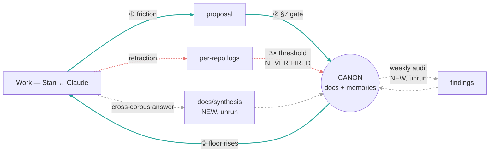
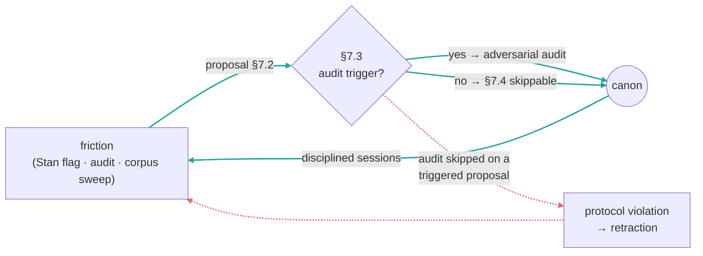
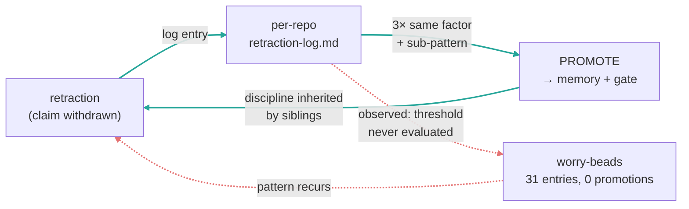
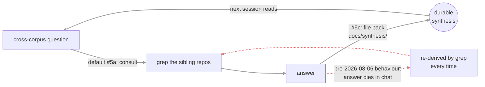
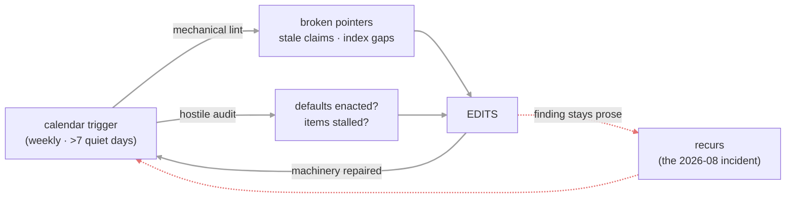

# The atu-method Improvement Loops

**Summary**: The four feedback loops by which this repo is supposed to get better at its own work — and their actual, unequal states. Only ONE is demonstrably turning: the **canon-amendment loop** (friction → proposal → §7 gate → canon), evidenced in git. The **retraction→promotion loop** is built and stalled: 31 logged retractions across three reader repos, **zero** promotions ever recorded, all logs frozen since 2026-05-17, and no log at this hub at all. The **file-back loop** and the **audit loop** were both closed on paper on 2026-08-06 and have never run. The shape is **additive, not compounding** — closing one rule-class does not make the next cheaper — with one unmeasured channel (cross-corpus porting) that might. Whether any of this measurably improves output is **unmeasured** (see Gap).

**Sources**: [`framework.md`](../01-normative/framework.md) §7.0–§7.9 (change discipline); [`retraction-log-protocol.md`](retraction-log-protocol.md) (3-recurrence threshold); [`../CLAUDE.md`](../CLAUDE.md) (8 standing defaults, audit tier, file-back); `git log` of this repo (108 commits) and of `readers-bofm` / `readers-gnt` / `readers-tanakh` retraction logs; the 2026-08-06 memory-loss incident recorded in [`../.archive/_WAKEUP-DIRECTIVE-2026-08-06.md`](../.archive/_WAKEUP-DIRECTIVE-2026-08-06.md). Form (per-loop frames, failure branches, explicit Gap-marking) is borrowed from the meta-wiki's `compounding-artifact.md` and `ops-improvement-loop.md`; the content is not.

**Last updated**: 2026-08-06

---

## Why this is not a wiki's virtuous cycle

The meta-wiki's loops run on *compiled sources*: raw documents are ingested, integrated, and linted against an immutable corpus. This repo's ground truth is different in kind — the canon is **normative and authored**. A rule is true here because it survived an adversarial gate and Stan promoted it, not because it compresses a source faithfully. So there is no ingest loop and no source-fidelity lint, and the analogous disciplines land differently: "lint against raw" becomes "audit against gate results," and "the human promotes into the schema" becomes §7.1 authority.

Four loops are described below because four exist, not to mirror the wiki's four. Their statuses are deliberately unequal, and three of the four are reported as broken or unproven.

## The whole picture at a glance



Colour key — **teal**: the one loop that demonstrably turns; **red**: the built-but-stalled retraction loop; **grey dashed**: the two loops adopted 2026-08-06 that have never executed a cycle.

```
                  ┌────────── ③ floor rises ↑ ──────────┐
                  ▼                                      │
   ┌──────────┐  ①   ┌──────────┐   ② §7 gate   ╔════════════════╗
   │   WORK   │─────▶│ proposal │──────────────▶║     CANON      ║
   │ Stan↔Cl. │      └──────────┘  audit+promote ╚════════════════╝
   └────┬─────┘                                    ▲    ▲     ▲
        ┊ retraction                               ┊    ┊     ┊
        ▼                                          ┊    ┊     ┊
   [per-repo logs] ┄ 3× threshold: NEVER FIRED ┄┄┄┄┘    ┊     ┊
   31 entries, 0 promotions, frozen 2026-05-17          ┊     ┊
                                                        ┊     ┊
   [docs/synthesis]  ┄ adopted 2026-08-06, never run ┄┄┄┘     ┊
   [weekly audit]    ┄ adopted 2026-08-06, never run ┄┄┄┄┄┄┄┄┄┘
```

## Loop 1 — Canon amendment (OPERATIONAL)



```
   friction ──▶ proposal ──▶ §7.3 gate ──▶ CANON ──▶ better sessions ──┐
      ▲                          ┊ skipped                            │
      └──────────── retraction ◀─┘ (protocol violation)               │
      └───────────────────────────────────────────────────────────────┘
```

**Evidenced.** This loop runs. Of the last 60 commits, 12 carry an explicit `Audit-skippable per §7.3` or `Audit dispatched:` declaration as §7.5 requires, and the canon-amendment commit series is continuous through 2026-06 (`4413af1`, `5398066`, `93d67f5`, `86e1219`…). The §7.5 declaration is what makes the loop auditable at a glance in `git log` — the discipline is legible from outside.

**Failure branch (real, not hypothetical).** Skipping audit on a triggered proposal is itself the defined protocol violation, and it has produced retractions — the Alma 34:7 PP-conj case shipped a rule, a regeneration, and +30 validator regressions before a Workflow audit caught that it contradicted the §2.2(ii) firewall it cited. That incident is why standing default #6 now demands a verbatim firewall quote.

## Loop 2 — Retraction → promotion (BUILT, STALLED)



```
   retraction ──▶ log entry ──▶ [3× same sub-pattern?] ──▶ PROMOTE ──▶ siblings inherit
                      ┊
                      ┊ threshold never evaluated
                      ▼
              WORRY-BEADS: 31 logged, 0 promoted, frozen 2026-05-17
```

**Evidenced failure — this is the sharpest finding in this document.** The mechanism is fully specified in [`retraction-log-protocol.md`](retraction-log-protocol.md): three retractions sharing a factor and sub-pattern promote into a memory file plus a rule-proposal gate. Measured 2026-08-06:

| Repo | Entries | `DISCIPLINE PROMOTED` blocks | Last commit to log |
|---|---|---|---|
| `readers-bofm` | 16 | 0 | 2026-05-17 |
| `readers-gnt` | 10 | 0 | 2026-05-17 |
| `readers-tanakh` | 5 | 0 | 2026-05-17 |
| `atu-method` (hub) | *no log exists* | — | — |
| `readers-lxx` / `readers-vulgate` / `readers-gnt-morph` / `rev-reader` | *no log exists* | — | — |

**Analysis.** Thirty-one retractions were captured and not one promotion was ever recorded, on a protocol whose entire purpose is bounding codification latency. The capture half works; the integration half has never executed. The threshold explicitly permits counting strikes *across* sibling repos (protocol §"Cross-corpus propagation"), which makes the absence more striking — pooled, 31 entries across three logs is a large sample for a 3-strike rule. Note the honest ambiguity: `feedback_three_anti_default_factors.md` (2026-05-16) *is* a promotion-shaped artifact, but it predates the last log entries and no log block cites it, so it cannot be attributed to the threshold firing.

**Why it stalled is not evidenced.** Nothing in the repo records a decision to stop. The logs simply stop on the same day all three were last touched, which is the signature of a cadence that was never scheduled rather than one that was abandoned.

## Loop 3 — Consult → file-back (ADOPTED 2026-08-06, NEVER RUN)



```
   question ──▶ consult siblings ──▶ answer ──▶ docs/synthesis ──▶ next session reads
                      ▲                  ┊
                      └── re-derive ◀────┘  (the open edge, before 2026-08-06)
```

**Designed, not proven.** Standing default #5 has mandated the *consult* half since long before this session — but the answer had nowhere to land, so each one was re-derived by grep on the next question. Standing default #5(c), adopted in `b4915b3`, closes the edge by requiring the answer to be written to `docs/synthesis/` in the same turn.

**Status is honest, not hopeful:** `docs/synthesis/` does not yet contain a single page. This loop has completed zero cycles. Its failure branch is not hypothetical — it is the documented behaviour of every prior session.

## Loop 4 — Audit (ADOPTED 2026-08-06, NEVER RUN)



```
   calendar ──┬──▶ mechanical lint ──┐
              └──▶ hostile audit ────┴──▶ EDITS ──▶ machinery repaired
                                          ┊
                                          └─ finding left as prose ──▶ recurs
```

**Created because its absence had a cost.** This loop did not exist until 2026-08-06. Its evidence is the incident that prompted it: the user-home memory namespace — 57 files including `_north_star.md`, which [`../CLAUDE.md`](../CLAUDE.md) called "never optional" — was deleted and nobody noticed for roughly six weeks. Three separate signals were sitting in plain sight: dead mandatory-read paths in the constitution, a migration flagged "pending" in three places since 2026-06-28, and `scripts/check_broken_pointers.py` — a broken-pointer detector that already existed and that no cadence ever ran.

**The generalisable lesson, and the reason this loop is calendar-triggered rather than activity-triggered:** the tool was never the missing piece. Drift accumulates *fastest* when nothing is happening, so a trigger that depends on activity cannot fire during the exact window it is needed. First run of the retargeted checker (2026-08-06) found 0 broken anchors and 57 broken doc paths.

**Zero cycles completed.** Everything above about this loop is design intent. The first real test is the first weekly wake that runs it without being told to.

## The shape — additive, with one unmeasured channel

**Analysis.** This is closer to the meta-wiki's *ops* loop than its *wiki* loop: closing one error-class does not make the next cheaper, so reliability accrues without accelerating. Calling it a "compounding artifact" would be the wrong shape.

One channel might genuinely compound, and it is named here precisely so it is not mistaken for a claim: **cross-corpus porting**. Hebrew binding rules B1–B14 have Greek analogues (ὅτι↔ki/B11, ὅς↔ʾăšer/B3), so a rule earned on one corpus may reduce the cost of the corresponding rule on the next — that is interest on interest, if it holds. But the discipline in `feedback_cross_corpus_convergence.md` explicitly forbids assuming it ("earn the convergence — re-derive each ported rule independently"), and nobody has measured whether porting is cheaper than deriving. Unmeasured.

## What this document does NOT claim (the Gap)

**Gap 1 — no instrument for "does this improve output."** No metric here connects loop activity to segmentation quality. The one real yardstick that exists (`bofm-atu-gold-yardstick.json`, 33 stratified verses, F1 ≈ 0.67 at 2026-05-28) measures the *product*, not the loops, and has not been re-run since. Nothing in this repo would currently detect a loop that ran faithfully and produced no improvement.

**Gap 2 — three of four loops have no track record at all.** Loops 3 and 4 are one day old; loop 2 has a track record and it is a record of not running. Only loop 1 has evidence of turning, and even there the evidence is *procedural* (audit declarations present in commits), not *outcome* evidence.

**Gap 3 — whether the four are the right four.** They are the loops that exist, drawn from real machinery. Nothing establishes that they are sufficient, and one candidate is deliberately absent: there is no loop that improves the *substrate* (parse quality), which [`substrate.md`](../03-implementation/substrate.md) argues is the actual ceiling on output quality. That may be the most important missing loop in this document.

## History

- [2026-08-06] Created per the wake-up directive's study-and-author assignment, after the memory-loss incident. Written against the traps its sibling `ops-improvement-loop.md` recorded having to audit out of an earlier draft: no compound-interest analogy, no manufactured symmetry with the wiki's four loops, no "internalised habit" rung (a category error for a stateless agent), no plateau claim that assumes fixed scope. Loop statuses are deliberately unequal and three of four are reported negatively.

## Related

- [`framework.md`](../01-normative/framework.md) §7 — the change discipline loop 1 runs on
- [`retraction-log-protocol.md`](retraction-log-protocol.md) — the mechanism loop 2 stalled on
- [`../CLAUDE.md`](../CLAUDE.md) — audit tier (loop 4) and standing default #5c (loop 3)
- [`substrate.md`](../03-implementation/substrate.md) — the substrate ceiling named in Gap 3
